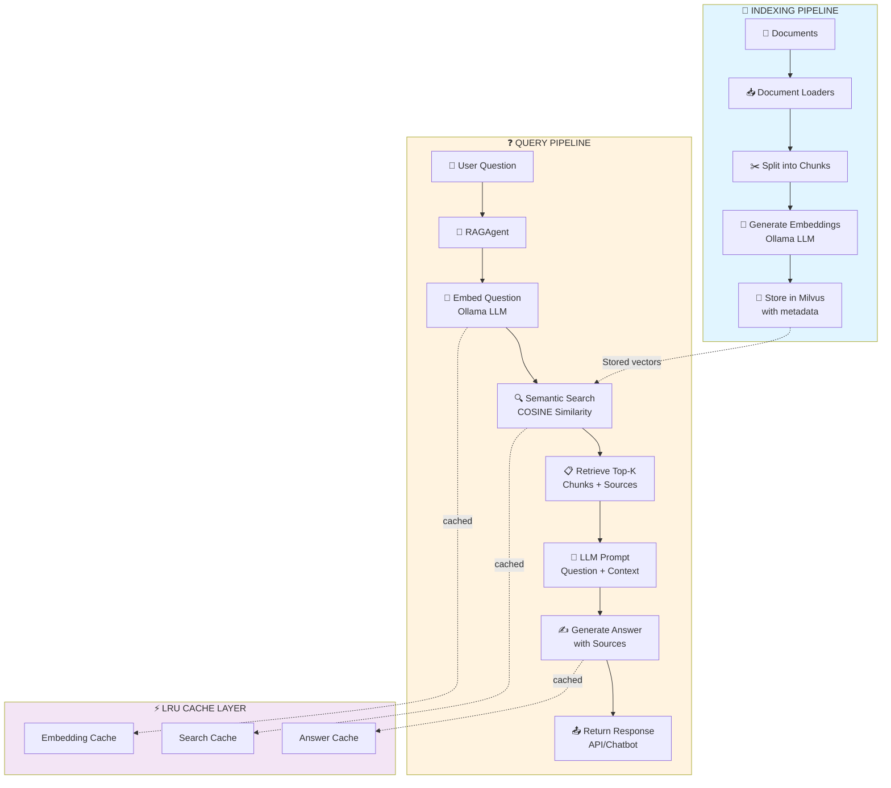

# AWS Strands Agents RAG

A high-performance Retrieval-Augmented Generation (RAG) system using AWS Strands Agents, Ollama for local LLM/embeddings, and Milvus as a vector database.

## Quick Start

**Optimal Configuration**: Uses **qwen2.5:0.5b** model (500M parameters) - 85% faster than larger models while maintaining high answer quality. See [Model Performance Comparison](docs/MODEL_PERFORMANCE_COMPARISON.md) for benchmarks.

## Features

- **Strands Agent Framework**: Built on StrandsRAGAgent with proper Strands Agents SDK integration
- **Local LLM & Embeddings**: Uses Ollama with qwen2.5:0.5b for fast, efficient inference
- **Vector Database**: Milvus with optimized indexing, caching, and performance tuning
- **Advanced Search**: Pagination, filtering by source, and async search capabilities
- **Batch Processing**: Efficient embedding generation with parallel workers
- **Caching System**: LRU caching for embeddings, searches, and answers intelligent agent capabilities
- **Multiple Document Loaders**: Support for files, URLs, and text documents
- **Optimized Deployment**: Integrated Docker setup with performance optimizations
- **React Web UI**: Modern streaming chatbot with beautiful interface
- **Multiple Deployment Options**: Docker, Local, and Serverless with AgentCore

## 📚 Documentation

**Getting Started**:
- **[GETTING_STARTED.md](docs/GETTING_STARTED.md)** - Complete setup and configuration guide
- **[ARCHITECTURE.md](docs/ARCHITECTURE.md)** - System architecture, tools, and skills overview
- **[REACT_DEPLOYMENT.md](docs/REACT_DEPLOYMENT.md)** - React chatbot deployment guide (Local, Docker, Serverless)

**Development & Integration**:
- **[DEVELOPMENT.md](docs/DEVELOPMENT.md)** - Development guide with code examples
- **[API_SERVER.md](docs/API_SERVER.md)** - FastAPI server documentation

**Performance & Configuration**:
- **[MODEL_PERFORMANCE_COMPARISON.md](docs/MODEL_PERFORMANCE_COMPARISON.md)** - Model benchmarking (qwen2.5:0.5b recommended)
- **[LATENCY_OPTIMIZATION.md](docs/LATENCY_OPTIMIZATION.md)** - Performance tuning strategies
- **[CACHING_STRATEGY.md](docs/CACHING_STRATEGY.md)** - Multi-layer caching architecture

**Architecture & Integration**:
- **[STRANDS_QUICK_REFERENCE.md](docs/STRANDS_QUICK_REFERENCE.md)** - Strands Agents SDK reference
- **[PROJECT_SUMMARY.md](docs/PROJECT_SUMMARY.md)** - Complete project overview

## Architecture Overview

```
┌──────────────────────┐
│  StrandsRAGAgent     │ ✅ Strands Agents Framework
│  (Strands-based)     │
└────────┬─────────────┘
         │
    ┌────┴──────┬──────────────┐
    │            │              │
┌───▼────┐  ┌───▼──────┐  ┌────▼────────┐
│ Ollama │  │ Milvus   │  │ Document    │
│(qwen   │  │ Vector   │  │ Loaders     │
│ 2.5)   │  │   DB     │  │             │
└────────┘  └──────────┘  └─────────────┘
```

**Components**:
- **StrandsRAGAgent**: Strands Agents SDK-compliant RAG agent with multi-layer caching
- **Ollama** (qwen2.5:0.5b): Local LLM for generation and embeddings
- **Milvus**: Vector database for semantic search
- **MCP Server**: Model Context Protocol server for tool management

## How It Works

### Query Processing Flow

1. **Content Processing**
   - Documents are loaded and split into chunks
   - Ollama (local LLM) generates embeddings for each chunk
   - Embeddings are stored in Milvus vector database with metadata (source, collection)

2. **Query Execution**
   - User asks a question → RAGAgent receives it
   - Question is embedded using Ollama
   - Milvus searches for semantically similar embeddings
   - Top-K relevant chunks are retrieved as context

3. **Answer Generation**
   - Retrieved context + original question sent to Ollama LLM
   - LLM generates an answer informed by the retrieved context
   - Sources (document references) included in the response

### Key Components

- **StrandsRAGAgent** (`src/agents/strands_rag_agent.py`): Strands Agents framework with RAG pipeline, intelligent caching, and security checks
- **MilvusVectorDB** (`src/tools/milvus_client.py`): Vector database wrapper with HNSW indexing and semantic search
- **OllamaClient** (`src/tools/ollama_client.py`): Local LLM client using qwen2.5:0.5b for fast inference
- **RAGAgentMCPServer** (`src/mcp/mcp_server.py`): Model Context Protocol server for tool management
- **API Server** (`api_server.py`): FastAPI server with OpenAI-compatible endpoints
- **Document Loaders** (`document-loaders/`): Tools to load, process, chunk, and embed documents
- **Chatbots** (`chatbots/`): Interactive CLI and React web UI for querying

### Performance Optimizations

- **LRU Caching**: Embeddings, searches, and answers cached to avoid redundant computation
- **Batch Processing**: Parallel embedding generation for efficient document indexing
- **Optimized Milvus**: 2GB query cache, 50GB disk cache, COSINE similarity search
- **Docker Setup**: Automated deployment with resource limits, health checks, and auto-recovery
- **Connection Pooling**: HTTP connection pooling for Ollama and Milvus to reuse connections
- **Request Timeouts**: Configurable timeouts for both Ollama and Milvus requests
- **Async Support**: Non-blocking async methods for RAG operations
- **Health Checks**: Comprehensive health check endpoints for service monitoring

### Data Flow Diagram



## Advanced Features

### Connection Pooling & Timeouts
- **HTTP Connection Pooling**: Reuses connections to Ollama and Milvus for better performance
- **Configurable Timeouts**: Set request timeouts to prevent hanging on slow/down services
  - `OLLAMA_TIMEOUT`: Default 30 seconds
  - `MILVUS_TIMEOUT`: Default 30 seconds
- **Connection Pool Sizes**: Configure pool sizes via environment variables
  - `OLLAMA_POOL_SIZE`: Default 5 connections
  - `MILVUS_POOL_SIZE`: Default 10 connections

### Authentication
- **Milvus Authentication**: Configurable username and password via environment variables
  - `MILVUS_USER`: Default `root`
  - `MILVUS_PASSWORD`: Default `Milvus`

### Health Checks & Monitoring
Three health check endpoints for service monitoring:

```bash
# Basic health check
curl http://localhost:8000/health

# Detailed health check with service status
curl http://localhost:8000/health/detailed

# Service-specific health checks
curl http://localhost:8000/health/ollama
curl http://localhost:8000/health/milvus
```

### Asynchronous Operations
Non-blocking async methods for long-running operations:

```python
# Async answer generation
answer, sources = await agent.answer_question_async(
    collection_name="my_collection",
    question="What is Milvus?"
)

# Async context retrieval
context, sources = await agent.retrieve_context_async(
    collection_name="my_collection",
    query="Milvus features"
)

# Streaming responses for large answers
async for chunk in agent.stream_answer(
    collection_name="my_collection",
    question="Explain Milvus architecture"
):
    print(chunk, end="", flush=True)
```

Streaming support also available via API endpoint:
```bash
curl http://localhost:8000/v1/chat/completions/stream \
  -H "Content-Type: application/json" \
  -d '{
    "messages": [{"role": "user", "content": "What is Milvus?"}],
    "stream": true
  }'
```

## Prerequisites

- Python 3.10+
- Docker & Docker Compose
- Ollama (running locally)
- 8GB+ RAM recommended (16GB+ for optimal performance)
- At least 20GB disk space

> **New**: This project now includes an integrated, optimized Docker setup in `./docker/` directory with automatic performance optimizations, health checks, and proper resource allocation.

## Quick Start

### 1. Setup Environment

```bash
# Clone the repository
cd /path/to/aws-stands-agents-rag

# Create .env file
cp .env.example .env

# Edit .env with your configuration (optional, defaults provided)
```

### 2. Start Milvus with Optimized Docker Setup (Recommended)

The `./docker/` directory contains an optimized Docker Compose setup with automatic performance tuning:

```bash
# Navigate to docker directory
cd docker

# Run optimization script (automatically optimizes and starts services)
chmod +x optimize.sh
./optimize.sh --all

# Verify services are healthy
docker-compose ps

# Return to project root for next steps
cd ..
```

**What Gets Optimized:**
- Memory limits per container (prevent resource exhaustion)
- CPU allocation and pinning
- tmpfs volumes for faster temporary files
- Health checks with automatic recovery
- Milvus-specific optimizations:
  - 2GB query cache
  - 50GB disk cache
  - 8 parallel index builders
  - COSINE similarity search

**Services:**
- Milvus: localhost:19530
- Milvus WebUI: http://localhost:9091/webui
- MinIO Console: http://localhost:9001
- etcd: localhost:2379

**Alternative: Quick Start** (without full optimizations)
```bash
cd docker
docker-compose up -d
cd ..
```

### 3. Install Ollama

```bash
# Download and install from https://ollama.ai

# Pull required models
ollama pull mistral      # For text generation
ollama pull all-minilm   # For embeddings (or nomic-embed-text)

# Start Ollama server (usually runs on http://localhost:11434)
ollama serve
```

### 4. Install Dependencies

```bash
# Using pip
pip install -e .

# Or using UV (faster)
uv sync
```

### 5. Start the API Server

```bash
# In a new terminal, from the project root:
uv run python api_server.py

# Server will start on http://localhost:8000
# Health check: curl http://localhost:8000/health
```

### 6. Run Examples

#### Option A: REST API (Ollama GUI compatible)

```bash
# Test with curl
curl -X POST http://localhost:8000/v1/chat/completions \
  -H "Content-Type: application/json" \
  -d '{
    "messages": [{"role": "user", "content": "What is Milvus?"}],
    "model": "rag-agent"
  }'
```

#### Option B: Interactive Chatbot

```bash
# In a new terminal:
uv run python examples/interactive_chat.py

# Then type questions and press Enter
# Type /quit to exit
# Type /help for more commands
```

## Configuration

### Environment Variables (.env)

```env
# Ollama Configuration
OLLAMA_HOST=http://localhost:11434
OLLAMA_MODEL=mistral:latest
OLLAMA_EMBED_MODEL=nomic-embed-text:v1.5

# Milvus Configuration
MILVUS_HOST=localhost
MILVUS_PORT=19530
MILVUS_DB_NAME=knowledge_base
LOADER_MILVUS_DB_NAME=knowledge_base

# Collection Configuration
OLLAMA_COLLECTION_NAME=milvus_rag_collection

# API Server Configuration
API_PORT=8000  # See API_PORT_STRATEGY.md for port conflict resolution

# Performance Settings
AGENT_CACHE_SIZE=500                    # LRU cache size for embeddings & queries
EMBEDDING_BATCH_SIZE=32                 # Batch size for bulk embedding operations
MAX_CHUNK_LENGTH=400                    # Maximum length of text chunks
EMBEDDING_DIM=768                       # Embedding vector dimension

# Application Configuration
LOG_LEVEL=INFO
BATCH_SIZE=10
```

**Port Configuration:** See [API_PORT_STRATEGY.md](docs/API_PORT_STRATEGY.md) for detailed information about managing API ports during local development and handling port conflicts.

**Collection Configuration Note:**
The `OLLAMA_COLLECTION_NAME` is used consistently across:
- Data loaders (`document-loaders/load_milvus_docs_ollama.py`)
- API server (`api_server.py`)
- Interactive chat (`chatbots/interactive_chat.py`)
- RAG agent (`src/agents/rag_agent.py`)

See [Collection Configuration Guide](docs/COLLECTION_CONFIG.md) for more details.

## Project Structure

```
aws-stands-agents-rag/
├── src/
│   ├── agents/              # Agent implementations
│   │   ├── rag_agent.py    # Main RAG agent
│   │   └── __init__.py
│   ├── tools/               # Tools and utilities
│   │   ├── milvus_client.py # Milvus wrapper
│   │   ├── ollama_client.py # Ollama wrapper
│   │   └── __init__.py
│   ├── loaders/             # Document loaders
│   │   ├── document_loader.py
│   │   └── __init__.py
│   └── config/              # Configuration
│       ├── settings.py
│       └── __init__.py
├── examples/                # Example scripts
│   ├── basic_rag.py
│   ├── file_based_rag.py
│   └── interactive_chat.py
├── docker/                  # Docker setup
│   └── docker-compose.yml
├── .env.example            # Environment template
├── pyproject.toml          # Project configuration
└── README.md               # This file
```

## Usage

### Basic RAG Pattern

```python
from src.config.settings import get_settings
from src.agents.strands_rag_agent import StrandsRAGAgent

# Initialize
settings = get_settings()
agent = StrandsRAGAgent(settings=settings)

# Add documents
documents = [{"text": "Document 1 text..."}, {"text": "Document 2 text..."}]
agent.add_documents(
    collection_name="my_docs",
    documents=documents
)

# Query
answer = agent.answer_question(
    collection_name="my_docs",
    question="What is the main topic?",
    top_k=3
)
print(answer)
```

### Custom Tools and Agents

The framework supports adding custom tools using Strands Agents SDK:

```python
from strands_agents import tool

@tool
def custom_tool(input: str) -> str:
    """Custom tool description."""
    return f"Result: {input}"

# Add to agent
agent.agent.add_tool(custom_tool)
```

## Available Ollama Models

### For Text Generation
- `mistral` - Fast, high-quality reasoning
- `llama2` - Meta's LLama 2 model
- `neural-chat` - Intel's Neural Chat
- `dolphin-mixtral` - Enhanced Mixtral variant

### For Embeddings
- `all-minilm` - Fast embedding model (384-dim)
- `nomic-embed-text` - High-quality embeddings (768-dim)
- `all-mpnet-base-v2` - MiniLM variant

Pull more models: `ollama pull <model-name>`

## Docker Management

### Quick Start with Optimized Setup

```bash
cd docker

# Full optimization and start (recommended)
./optimize.sh --all

# Or just start containers
./optimize.sh --start

# Monitor services
docker-compose ps
docker stats

# View service logs
docker-compose logs -f [service]
docker-compose logs -f milvus
docker-compose logs -f rag-api

# Stop all services
docker-compose down

# Full cleanup
docker-compose down -v
```

### Optimization Options

```bash
cd docker

# Show available options
./optimize.sh --help

# Options:
# --daemon         Configure Docker daemon settings
# --macos          macOS-specific recommendations
# --linux          Linux system optimization
# --cleanup        Clean Docker resources
# --all            Full optimization + start (recommended)
# --start          Start containers with existing config
# --info           Show service information
# --monitor        Show performance monitoring commands
```

### Service Health Checks

```bash
# Check all services
docker-compose ps

# Test individual services
curl http://localhost:8000/health           # RAG API
curl http://localhost:19530                 # Milvus gRPC
curl http://localhost:9091/healthz          # Milvus HTTP
curl http://localhost:9000/minio/health     # MinIO
```

### For Linux Users

Run the optimization script to configure system parameters:

```bash
cd docker
./optimize.sh --linux
./optimize.sh --start
```

This sets up:
- File descriptor limits (65536)
- Memory swappiness optimization
- Virtual memory mapping for Milvus
- Network optimizations

## Milvus Operations

### Using Python

```python
from src.tools import MilvusVectorDB

db = MilvusVectorDB(
    host="localhost",
    port=19530,
    db_name="knowledge_base"
)

# List collections
collections = db.list_collections()

# Search
results = db.search(
    collection_name="my_docs",
    query_embedding=[...],
    limit=5
)
```

### Using Milvus CLI

```bash
# Install
pip install pymilvus

# Connect
milvus_cli

# In CLI:
# connect -uri http://localhost:19530
# list databases
# use database knowledge_base
# list collections
# show collection_name
```

## Troubleshooting

### Ollama Not Available
```bash
# Check if Ollama is running
curl http://localhost:11434/api/tags

# Start Ollama
ollama serve

# Check model
ollama list
```

### Milvus Connection Issues
```bash
# Check container status
docker-compose -f docker/docker-compose.yml ps

# View logs
docker-compose -f docker/docker-compose.yml logs milvus

# Restart services
docker-compose -f docker/docker-compose.yml restart
```

### Memory Issues
- Reduce `BATCH_SIZE` in .env
- Use smaller embedding models
- Reduce `chunk_size` in document loading
- Check available system memory

## Advanced Features

### Pagination

```python
from src.agents.strands_rag_agent import StrandsRAGAgent

agent = StrandsRAGAgent(settings=settings)

# Get paginated results
page = 0
page_size = 5
context, sources, total = agent.paginated_search(
    collection_name="my_docs",
    question="What is Milvus?",
    page=page,
    page_size=page_size
)
```

### Filtering by Source

```python
# Search only specific document source
context, sources = agent.search_by_source(
    collection_name="my_docs",
    question="What is Milvus?",
    source="milvus_docs",  # Filter by document source
    top_k=5
)
```

### Batch Embedding (Parallel)

```python
# Efficient batch embedding with parallel workers
embeddings = agent.ollama_client.embed_texts(
    texts=["text1", "text2", "text3", ...],
    model="nomic-embed-text",
    batch_size=32,        # Process 32 texts per batch
    max_workers=4         # Use 4 parallel workers
)
```

### Advanced Search with Metadata Filtering

```python
# Search database directly with filtering
results = agent.vector_db.search(
    collection_name="docs",
    query_embedding=[...],
    limit=10,
    offset=0,             # Skip first N results (pagination)
    filter_expr="source == 'milvus_docs'",  # Filter by metadata
    search_params={"ef": 64}  # HNSW parameter
)

# Or search by source directly
results = agent.vector_db.search_by_source(
    collection_name="docs",
    query_embedding=[...],
    source="milvus_docs",
    limit=5
)
```

### Async Search

```python
import asyncio

async def async_search():
    # Non-blocking search
    results = await agent.vector_db.search_async(
        collection_name="docs",
        query_embedding=[...],
        limit=10,
        offset=0
    )
    return results

# Run async search
results = asyncio.run(async_search())
```

### Custom Embedding Models

```python
agent = StrandsRAGAgent(settings=settings)

# Use different embedding model
embeddings = agent.ollama_client.embed_texts(
    texts=["text1", "text2"],
    model="all-mpnet-base-v2"  # Different model
)
```

### Collection Management

```python
# Create collection with custom parameters
agent.vector_db.create_collection(
    collection_name="my_docs",
    embedding_dim=768,
    index_type="HNSW",      # or "IVF_FLAT", "FLAT"
    metric_type="COSINE"    # or "L2", "IP"
)

# List all collections
collections = agent.vector_db.list_collections()

# Delete collection
agent.vector_db.delete_collection("temp_collection")
```

### Metadata Support

```python
agent.vector_db.insert_embeddings(
    collection_name="docs",
    embeddings=embeddings,
    texts=texts,
    metadata=[
        {"source": "file1.txt", "page": 1, "author": "John"},
        {"source": "file2.txt", "page": 2, "author": "Jane"},
    ]
)
```

## Testing

This project includes a comprehensive test suite using pytest. For detailed testing information, see [tests/README.md](tests/README.md).

### Quick Start with Testing

```bash
# Install dependencies with test support
uv sync --all-extras

# Run all tests
uv run pytest

# Run with coverage report
uv run pytest --cov=src --cov-report=html

# Run specific test file
uv run pytest tests/test_rag_agent.py -v

# Run in parallel for speed
uv run pytest -n auto
```

### Test Coverage

The test suite covers:
- **OllamaClient**: Connection pooling, timeouts, embeddings, health checks
- **RAGAgent**: Caching, retrieval, async operations, document management
- **API Endpoints**: Health checks, chat completions, streaming responses
- **Error Handling**: Timeouts, connection failures, invalid requests

Target coverage: > 80% overall, > 90% for core modules

## Documentation

### 📋 Architecture Review (New - Start Here!)
- **[ARCHITECTURE_REVIEW_SUMMARY.md](docs/ARCHITECTURE_REVIEW_SUMMARY.md)** - ⭐ **Read this first** Executive summary of findings and roadmap
- **[ARCHITECTURE_EVALUATION.md](docs/ARCHITECTURE_EVALUATION.md)** - Comprehensive assessment vs. Strands standards
- **[IMPLEMENTATION_GUIDE.md](docs/IMPLEMENTATION_GUIDE.md)** - Corrective implementation with code examples
- **[STRANDS_QUICK_REFERENCE.md](docs/STRANDS_QUICK_REFERENCE.md)** - Developer quick reference

### 🚀 Phase 1-2 Implementation (Strands Agents Refactor - Complete!)
- **[ARCHITECTURE.md](docs/ARCHITECTURE.md)** - Complete system architecture with tools, skills, and MCP protocol
- **[STRANDS_QUICK_REFERENCE.md](docs/STRANDS_QUICK_REFERENCE.md)** - Quick reference for Strands agent patterns
- **[DEVELOPMENT.md](docs/DEVELOPMENT.md)** - Developer guide with code examples

**Historical Documentation** (for reference):
- **[PHASE_1_2_COMPLETION_SUMMARY.md](docs/PHASE_1_2_COMPLETION_SUMMARY.md)** - Implementation completion details
- **[PHASE_1_2_ARCHITECTURE.md](docs/PHASE_1_2_ARCHITECTURE.md)** - Phase 1-2 architecture documentation
- **[PHASE_1_2_TESTING.md](docs/PHASE_1_2_TESTING.md)** - Testing guide from Phase 1-2
- **[PHASE_1_2_QUICK_REFERENCE.md](docs/PHASE_1_2_QUICK_REFERENCE.md)** - Quick reference from Phase 1-2

**Status**: ✅ Complete - 6 tools registered across 3 skills, MCP endpoints, optimized for Strands  
**Try it**: `python examples/phase_1_2_examples.py`

### Getting Started & Development
- [Getting Started Guide](docs/GETTING_STARTED.md) - Step-by-step setup instructions
- [Development Guide](docs/DEVELOPMENT.md) - Development and contribution guidelines
- [Collection Configuration](docs/COLLECTION_CONFIG.md) - Manage collections and configuration

### Operational & Reference
- [API Server Documentation](docs/API_SERVER.md) - REST API and MCP endpoints
- [Project Summary](docs/PROJECT_SUMMARY.md) - Complete project overview
- [Docker Setup](docker/README.md) - Detailed Docker and performance optimization
- [Docker Migration Guide](scripts/DOCKER_MIGRATION.md) - Migrate from legacy milvus-standalone setup

## Integration with AWS Services

For production deployment with AWS:

- **AWS Lambda**: Deploy agent as serverless function
- **Amazon Bedrock**: Use Claude/Nova models instead of Ollama
- **Amazon S3**: Store documents and model weights
- **Amazon ECS**: Containerized agent deployment
- **Amazon RDS**: Persistent session storage

See [Strands Agents Deployment Guide](https://strandsagents.com/latest/documentation/docs/user-guide/deploy/) for details.

## Performance Tips

1. **Batch Processing**: Use `embed_texts()` with `batch_size` and `max_workers` for parallel embedding
2. **Caching**: Leverage built-in LRU caching (embeddings, searches, answers) - configure `AGENT_CACHE_SIZE`
3. **Pagination**: Use `paginated_search()` for large result sets instead of loading all at once
4. **Filtering**: Use source filters to narrow search scope and improve performance
5. **Docker Optimization**: Run `./docker/optimize.sh --all` for automatic system and Docker tuning
6. **Index Type**: Use HNSW (default) for balanced speed/accuracy, IVF_FLAT for large datasets
7. **Model Selection**: Use smaller embedding models (e.g., all-minilm) for faster inference
8. **Resource Allocation**: Docker setup allocates:
   - Milvus: 4 CPU, 8GB RAM, 2GB cache
   - MinIO: 2 CPU, 2GB RAM
   - etcd: 1 CPU, 1GB RAM
   - RAG API: 2 CPU, 2GB RAM

## 🛣️ Roadmap & Future Improvements

### ✅ Recently Completed
- [x] Hybrid keyword + LLM scope classification (90% faster)
- [x] Simplified system prompt architecture
- [x] Similarity threshold filtering (0.65 distance cutoff)
- [x] Multiple collection search support
- [x] Reordered RAG prompt (instructions → question → context → sources)
- [x] Document source attribution with relevance scores

### 📋 Planned Improvements

**High Priority**:
7. **Optimize embedding cache** - Add timestamp-based expiration for stale embeddings (configurable TTL)
8. **Streaming response refinement** - Better chunking for streaming to avoid mid-sentence breaks
9. **Answer confidence scoring** - Return confidence levels with responses based on retrieval quality

**Medium Priority**:
10. **Performance instrumentation** - Add detailed latency breakdown logging for each phase (scope check, retrieval, generation)
11. **Multi-model support** - Support for multiple embedding and generation models simultaneously
12. **Semantic deduplication** - Detect and filter near-duplicate context chunks before generation
13. **Independent MCP Server** - Refactor MCP server as optional standalone microservice for high-scale production, multi-tenancy, and fault isolation (currently integrated with FastAPI)

**Future Enhancements**:
- Custom collection schemas for specialized data types
- Hybrid BM25 + semantic search (dense + sparse retrieval)
- Fine-tuned models for specialized domains
- Response streaming with real-time token generation
- Advanced cache strategies (time-based, LRU with TTL)
- Evaluation framework for answer quality metrics

## Contributing

Contributions are welcome! Please:

1. Fork the repository
2. Create a feature branch
3. Make your changes
4. Submit a pull request

## Resources

- [Strands Agents Documentation](https://strandsagents.com/latest/documentation/)
- [Strands Agents Examples](https://strandsagents.com/latest/documentation/docs/examples/)
- [Ollama Documentation](https://github.com/ollama/ollama)
- [Milvus Documentation](https://milvus.io/docs)
- [Milvus Python SDK](https://milvus.io/docs/pymilvus-ref/)

## License

MIT License - See LICENSE file for details

## Support

For issues and questions:
- Check existing documentation
- Review example scripts
- Check Strands Agents community resources
- Open an issue in the repository

---

**Happy Building! 🚀**
