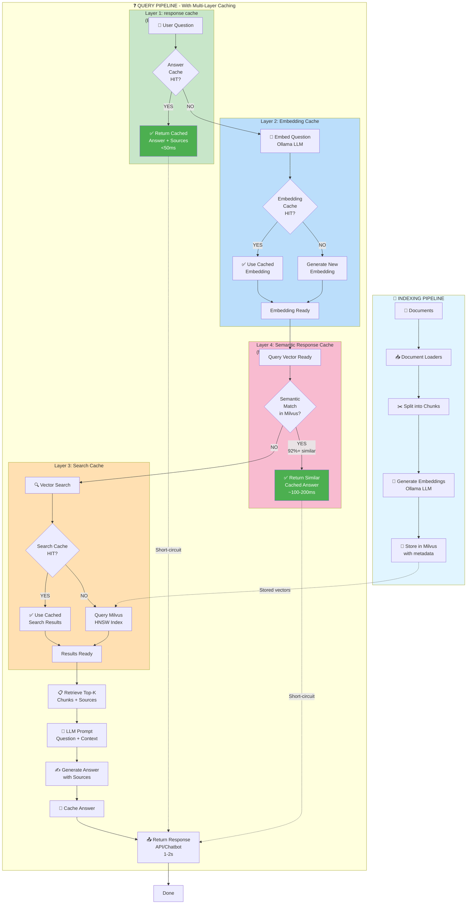

# AWS Strands Agents RAG

A high-performance Retrieval-Augmented Generation (RAG) system using AWS Strands Agents, Ollama for local LLM/embeddings, and Milvus as a vector database.

**Key Features**: Strands framework integration • Local LLM (qwen2.5:0.5b) • Milvus vector DB • Multi-layer caching (1200x speedup) • Web search integration • React UI • Docker deployment

## 📚 Documentation

| Category | Documents |
|----------|-----------|
| **Getting Started** | [Setup Guide](docs/GETTING_STARTED.md) • [Configuration](docs/GETTING_STARTED.md#configuration) |
| **Architecture** | [System Design](docs/ARCHITECTURE.md) • [Data Flow](docs/ARCHITECTURE.md#data-flow) • [Caching](docs/CACHING_STRATEGY.md) • [AWS Deployment](docs/AWS_ARCHITECTURE.md) • [Chat + Skills Flow](docs/CHAT_REQUEST_SKILLS_FLOW.md) |
| **Development** | [Code Examples](docs/DEVELOPMENT.md) • [API Reference](docs/API_SERVER.md) • [Strands Reference](docs/STRANDS_QUICK_REFERENCE.md) |
| **Operations** | [React Deployment](docs/REACT_DEPLOYMENT.md) • [Docker Setup](docker/README.md) • [Troubleshooting](docs/GETTING_STARTED.md#troubleshooting) |
| **CI/CD** | [GitHub Actions Setup](docs/GITHUB_ACTIONS_SETUP.md) |
| **Performance** | [Model Comparison](docs/MODEL_PERFORMANCE_COMPARISON.md) • [Optimization](docs/LATENCY_OPTIMIZATION.md) • [Tips](docs/LATENCY_OPTIMIZATION.md#performance-tips) |

## Architecture Overview

```
┌──────────────────────┐
│  StrandsRAGAgent     │ ✅ Strands Agents Framework
│  (Strands-based)     │
└────────┬─────────────┘
         │
    ┌────┴──────┬──────────────┐
    │            │              │
┌───▼────┐  ┌───▼──────┐  ┌────▼────────┐
│ Ollama │  │ Milvus   │  │ Document    │
│(qwen   │  │ Vector   │  │ Loaders     │
│ 2.5)   │  │   DB     │  │             │
└────────┘  └──────────┘  └─────────────┘
```

**Components**:
- **StrandsRAGAgent**: Strands Agents SDK-compliant RAG agent with multi-layer caching
- **Ollama** (qwen2.5:0.5b): Local LLM for generation and embeddings
- **Milvus**: Vector database for semantic search
- **MCP Server**: Model Context Protocol server for tool management

## How It Works

**Pipeline**: Documents → Embeddings → Milvus Vector Search → LLM Answer Generation

Multi-layer caching (embedding, search, answer, semantic) provides 1200x speedup on cached queries.

### Data Flow Diagram



**Cache Performance Summary:**
- **Layer 1 Hit** (exact answer): <50ms (1200x faster than full pipeline)
- **Layer 2 Hit** (embedding cached): ~100-200ms (700x faster)
- **Layer 3 Hit** (search cached): ~300-500ms (300x faster)
- **Layer 4 Hit** (semantic match): ~100-200ms (600x faster)
- **Cache Miss** (full pipeline): ~1-2s (baseline)

## Advanced Features

### Connection Pooling & Timeouts
- **HTTP Connection Pooling**: Reuses connections to Ollama and Milvus for better performance
- **Configurable Timeouts**: Set request timeouts to prevent hanging on slow/down services
  - `OLLAMA_TIMEOUT`: Default 30 seconds
  - `MILVUS_TIMEOUT`: Default 30 seconds
- **Connection Pool Sizes**: Configure pool sizes via environment variables
  - `OLLAMA_POOL_SIZE`: Default 5 connections
  - `MILVUS_POOL_SIZE`: Default 10 connections

### Authentication
- **Milvus Authentication**: Configurable username and password via environment variables
  - `MILVUS_USER`: Default `root`
  - `MILVUS_PASSWORD`: Default `Milvus`

### Health Checks & Monitoring
Three health check endpoints for service monitoring:

```bash
# Basic health check
curl http://localhost:8000/health

# Detailed health check with service status
curl http://localhost:8000/health/detailed

# Service-specific health checks
curl http://localhost:8000/health/ollama
curl http://localhost:8000/health/milvus
```

### Asynchronous Operations
Non-blocking async methods for long-running operations:

```python
# Async answer generation
answer, sources = await agent.answer_question_async(
    collection_name="my_collection",
    question="What is Milvus?"
)

# Async context retrieval
context, sources = await agent.retrieve_context_async(
    collection_name="my_collection",
    query="Milvus features"
)

# Streaming responses for large answers
async for chunk in agent.stream_answer(
    collection_name="my_collection",
    question="Explain Milvus architecture"
):
    print(chunk, end="", flush=True)
```

Streaming support also available via API endpoint:
```bash
curl http://localhost:8000/v1/chat/completions/stream \
  -H "Content-Type: application/json" \
  -d '{
    "messages": [{"role": "user", "content": "What is Milvus?"}],
    "stream": true
  }'
```

## Quick Start

```bash
# 1. Start services
cd docker && ./optimize.sh --all && cd ..

# 2. Pull models  
ollama pull qwen2.5:0.5b nomic-embed-text:v1.5

# 3. Install & run
pip install -e .
python api_server.py

# 4. Test
curl http://localhost:8000/health
```

👉 **[Full setup guide →](docs/GETTING_STARTED.md)**

## Project Structure

```
aws-strands-agents-rag/
├── src/agents/              # StrandsRAGAgent implementation
├── src/tools/               # Ollama & Milvus clients
├── src/config/              # Configuration management
├── document-loaders/        # Document loading utilities
├── docker/                  # Docker Compose setup
├── tests/                   # Test suite
├── docs/                    # Detailed documentation
└── README.md                # This file
```

## Usage

See [DEVELOPMENT.md](docs/DEVELOPMENT.md) for:
- Basic RAG pattern and examples
- Custom tools and agents
- Advanced features (filtering, batch processing, async, metadata, etc.)
- Web search integration
- Entity validation and caching strategies

## Roadmap

**Todos:**
- [ ] Show a responses cache list to the web app users 
- [ ] Integrate pre-commit into GitHub pipeline
- [ ] Serverless deployment with AgentCore (Lambda, SAM, CloudFront)
- [ ] AgentCore SessionManager for conversation history caching

## Contributing

Contributions are welcome! Please:

1. Fork the repository
2. Create a feature branch
3. Make your changes
4. Submit a pull request

## Resources

- [Strands Agents Documentation](https://strandsagents.com/latest/documentation/)
- [Ollama Documentation](https://github.com/ollama/ollama)
- [Milvus Documentation](https://milvus.io/docs)
- [Milvus Python SDK](https://milvus.io/docs/pymilvus-ref/)

## License

MIT License - See LICENSE file for details

## Support

For issues and questions:
- Check existing documentation
- Review example scripts
- Check Strands Agents community resources
- Open an issue in the repository

---

**Happy Building! 🚀**
