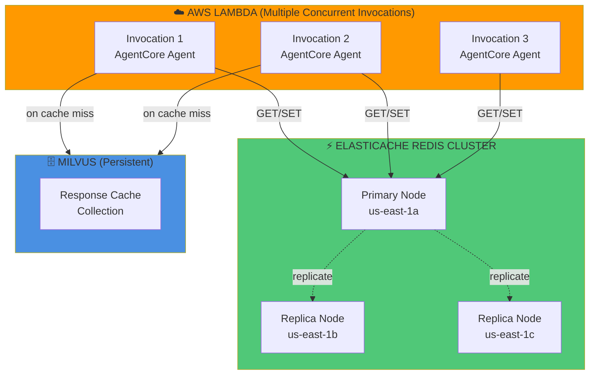

# AgentCore Caching Strategy: Serverless Deployment

**Document Version**: 1.0
**Last Updated**: March 7, 2026
**Target Platform**: AWS Lambda + Bedrock AgentCore
**Status**: Production Roadmap

---

## Executive Summary

This document adapts the caching improvements from [CACHING_STRATEGY_IMPROVEMENTS.md](CACHING_STRATEGY_IMPROVEMENTS.md) for **serverless AgentCore deployment** on AWS Lambda. Key differences from container-based deployment:

- **No in-memory caches** (Lambda is stateless)
- **Distributed caching** via ElastiCache Redis or DynamoDB
- **AgentCore SessionManager** replaces custom conversation tracking
- **CloudWatch integration** for metrics and monitoring

**Current State**: Single-layer Milvus Response Cache
**Target Goal**: Multi-layer distributed caching with 300-400ms speedup and 40-60% higher hit rates

---

## 🏗️ Architecture: Serverless vs Container-Based

### Container-Based (ECS/Fargate)
```
┌──────────────────────────────────────┐
│ ECS Container (Persistent Process)   │
│ ┌──────────────────────────────────┐ │
│ │ In-Memory Caches (OrderedDict)   │ │ ← Works fine (persistent)
│ │ • embedding_cache                │ │
│ │ • search_cache                   │ │
│ └──────────────────────────────────┘ │
│ ┌──────────────────────────────────┐ │
│ │ Milvus Response Cache            │ │
│ └──────────────────────────────────┘ │
└──────────────────────────────────────┘
```

### Serverless (Lambda + AgentCore)
```
┌──────────────────────────────────────┐
│ Lambda Invocation 1                  │
│ ┌──────────────────────────────────┐ │
│ │ In-Memory Cache: {}              │ │ ← EMPTY (stateless)
│ └──────────────────────────────────┘ │
└──────────────────────────────────────┘
         ↓ invocation ends ↓
┌──────────────────────────────────────┐
│ Lambda Invocation 2                  │
│ ┌──────────────────────────────────┐ │
│ │ In-Memory Cache: {}              │ │ ← EMPTY AGAIN!
│ └──────────────────────────────────┘ │
└──────────────────────────────────────┘

✅ SOLUTION: Use Distributed Cache
┌──────────────────────────────────────┐
│ All Lambda Invocations               │
│          ↓                           │
│ ┌──────────────────────────────────┐ │
│ │ ElastiCache Redis (Shared)       │ │ ← Persistent across invocations
│ │ • Embedding Cache (1hr TTL)      │ │
│ │ • Search Cache (24hr TTL)        │ │
│ └──────────────────────────────────┘ │
│ ┌──────────────────────────────────┐ │
│ │ Milvus Response Cache            │ │
│ └──────────────────────────────────┘ │
└──────────────────────────────────────┘
```

---

## ❌ Improvements to Remove for AgentCore

### #1: In-Memory Embedding Cache
**Container Version**: Uses Python `OrderedDict` for LRU caching
**Problem**: Lambda is stateless - cache resets every invocation
**Replacement**: **ElastiCache Redis** with 1-hour TTL (see #12 below)

### #2: In-Memory Search Results Cache
**Container Version**: Uses Python `OrderedDict` for search results
**Problem**: Same as #1 - no persistence across invocations
**Replacement**: **ElastiCache Redis** with 24-hour TTL (see #12 below)

### #9: File-Based Question Tracker
**Container Version**: Writes `logs/question_frequency.json` locally
**Problem**:
- Lambda filesystem is ephemeral (lost after execution)
- No shared tracking across parallel invocations
- AgentCore SessionManager already tracks conversations

**Replacement**: **DynamoDB Analytics Queries** on AgentCore session data (see #13 below)

---

## ✅ Improvements to Keep (Unchanged)

These remain valuable in serverless AgentCore deployment:

### #3: Cache TTL (Time-To-Live)
**Status**: ✅ **Keep as-is**
**Why**: Milvus Response Cache is persistent - TTL prevents stale answers regardless of deployment model

### #4: Cache Hit Rate Metrics
**Status**: ✅ **Keep with CloudWatch integration**
**Why**: Monitoring is critical in serverless - metrics auto-publish to CloudWatch

### #5: Use `agent_cache_size` Setting
**Status**: ⚠️ **Repurpose for Redis**
**Why**: Use `AGENT_CACHE_SIZE` to configure Redis max entries instead of in-memory cache

### #6: Negative Caching
**Status**: ✅ **Keep in Redis**
**Why**: Cache failed searches in Redis (5-minute TTL) - works across Lambda invocations

### #7: Optimize Similarity Threshold
**Status**: ✅ **Keep as-is**
**Why**: Response cache tuning is independent of deployment platform

### #8: Cache Compression
**Status**: ✅ **Keep as-is**
**Why**: Reduces Milvus storage and network transfer - same benefit in Lambda

### #10: Cache Versioning
**Status**: ✅ **Keep as-is**
**Why**: Document version tracking works the same way in serverless

### #11: Multi-Source Cache Warmup
**Status**: ✅ **Keep as-is**
**Why**: Pre-warm Milvus response cache at deployment time (Lambda cold start)

---

## ➕ New AgentCore-Specific Improvements

### #12: ElastiCache Redis for Distributed Caching

**Purpose**: Replace in-memory caches (#1, #2) with shared Redis cluster
**Effort**: Medium | **Impact**: High | **Priority**: ⭐⭐⭐

#### Expected Benefit
- **Shared cache** across all Lambda invocations
- **No cold start penalty** - cache survives between executions
- **Latency**: 1-3ms Redis lookup (vs 256ms embedding generation)
- **Multi-AZ HA** for production reliability

#### Architecture



#### Implementation

**1. Infrastructure Setup (CloudFormation/Terraform)**

```yaml
# CloudFormation snippet
ElastiCacheSubnetGroup:
  Type: AWS::ElastiCache::SubnetGroup
  Properties:
    Description: Subnet group for Redis cluster
    SubnetIds:
      - !Ref PrivateSubnet1
      - !Ref PrivateSubnet2
      - !Ref PrivateSubnet3

ElastiCacheCluster:
  Type: AWS::ElastiCache::ReplicationGroup
  Properties:
    ReplicationGroupId: rag-agent-cache
    ReplicationGroupDescription: RAG Agent distributed cache
    Engine: redis
    CacheNodeType: cache.r6g.large  # 13.07 GiB memory
    NumCacheClusters: 3  # 1 primary + 2 replicas
    AutomaticFailoverEnabled: true
    MultiAZEnabled: true
    SecurityGroupIds:
      - !Ref ElastiCacheSecurityGroup
    CacheSubnetGroupName: !Ref ElastiCacheSubnetGroup
```

**2. Redis Client (Python)**

```python
# In src/tools/redis_cache.py (NEW FILE)
import redis
import json
import hashlib
from typing import Optional, List, Dict, Any
from datetime import timedelta

class RedisDistributedCache:
    """Distributed cache using ElastiCache Redis."""

    def __init__(self, host: str, port: int = 6379, db: int = 0):
        """Initialize Redis connection.

        Args:
            host: ElastiCache cluster endpoint
            port: Redis port (default 6379)
            db: Redis database number (0-15)
        """
        self.client = redis.Redis(
            host=host,
            port=port,
            db=db,
            decode_responses=True,  # Auto-decode bytes to strings
            socket_connect_timeout=5,
            socket_timeout=5,
            retry_on_timeout=True,
            health_check_interval=30,
        )

        # Test connection
        try:
            self.client.ping()
            logger.info(f"✓ Connected to Redis at {host}:{port}")
        except redis.ConnectionError as e:
            logger.error(f"Failed to connect to Redis: {e}")
            raise

    def get_embedding(self, text: str) -> Optional[List[float]]:
        """Get cached embedding.

        Args:
            text: Text to retrieve embedding for

        Returns:
            Embedding vector or None if not cached
        """
        cache_key = f"embedding:{hashlib.sha256(text.encode()).hexdigest()}"

        try:
            cached = self.client.get(cache_key)
            if cached:
                logger.debug(f"✓ Redis embedding cache HIT")
                return json.loads(cached)

            logger.debug(f"✗ Redis embedding cache MISS")
            return None
        except Exception as e:
            logger.warning(f"Redis get failed: {e}")
            return None

    def set_embedding(
        self,
        text: str,
        embedding: List[float],
        ttl_hours: int = 1,
    ) -> bool:
        """Store embedding in cache.

        Args:
            text: Original text
            embedding: Embedding vector
            ttl_hours: Time-to-live in hours (default: 1)

        Returns:
            True if stored successfully
        """
        cache_key = f"embedding:{hashlib.sha256(text.encode()).hexdigest()}"

        try:
            self.client.setex(
                name=cache_key,
                time=timedelta(hours=ttl_hours),
                value=json.dumps(embedding),
            )
            logger.debug(f"✓ Stored embedding in Redis (TTL: {ttl_hours}h)")
            return True
        except Exception as e:
            logger.warning(f"Redis set failed: {e}")
            return False

    def get_search_results(
        self,
        collection: str,
        query: str,
        top_k: int,
    ) -> Optional[Dict[str, Any]]:
        """Get cached search results.

        Args:
            collection: Collection name
            query: Search query
            top_k: Number of results

        Returns:
            Cached search results or None
        """
        cache_key = f"search:{collection}:{hashlib.sha256(query.encode()).hexdigest()}:{top_k}"

        try:
            cached = self.client.get(cache_key)
            if cached:
                logger.debug(f"✓ Redis search cache HIT")
                return json.loads(cached)

            logger.debug(f"✗ Redis search cache MISS")
            return None
        except Exception as e:
            logger.warning(f"Redis get failed: {e}")
            return None

    def set_search_results(
        self,
        collection: str,
        query: str,
        top_k: int,
        results: Dict[str, Any],
        ttl_hours: int = 24,
    ) -> bool:
        """Store search results in cache.

        Args:
            collection: Collection name
            query: Search query
            top_k: Number of results
            results: Search results to cache
            ttl_hours: Time-to-live in hours (default: 24)

        Returns:
            True if stored successfully
        """
        cache_key = f"search:{collection}:{hashlib.sha256(query.encode()).hexdigest()}:{top_k}"

        try:
            self.client.setex(
                name=cache_key,
                time=timedelta(hours=ttl_hours),
                value=json.dumps(results),
            )
            logger.debug(f"✓ Stored search results in Redis (TTL: {ttl_hours}h)")
            return True
        except Exception as e:
            logger.warning(f"Redis set failed: {e}")
            return False

    def get_stats(self) -> Dict[str, Any]:
        """Get Redis cache statistics.

        Returns:
            Dict with cache metrics
        """
        try:
            info = self.client.info("stats")
            return {
                "total_keys": self.client.dbsize(),
                "hits": info.get("keyspace_hits", 0),
                "misses": info.get("keyspace_misses", 0),
                "hit_rate": (
                    info["keyspace_hits"] / (info["keyspace_hits"] + info["keyspace_misses"])
                    if (info.get("keyspace_hits", 0) + info.get("keyspace_misses", 0)) > 0
                    else 0.0
                ),
                "evicted_keys": info.get("evicted_keys", 0),
                "memory_used_mb": info.get("used_memory", 0) / 1024 / 1024,
            }
        except Exception as e:
            logger.warning(f"Failed to get Redis stats: {e}")
            return {"error": str(e)}
```

**3. Integration with Agent**

```python
# In src/agents/strands_graph_agent.py (AgentCore version)
class StrandsGraphRAGAgent:
    def __init__(self, settings: Settings):
        # ... existing initialization ...

        # Initialize Redis distributed cache (if configured)
        self.redis_cache = None
        if settings.redis_cache_enabled:
            try:
                from src.tools.redis_cache import RedisDistributedCache
                self.redis_cache = RedisDistributedCache(
                    host=settings.redis_host,
                    port=settings.redis_port,
                    db=settings.redis_db,
                )
            except Exception as e:
                logger.warning(f"Failed to initialize Redis cache: {e}")

        # ... rest of initialization ...

    def _get_cached_embedding(self, text: str) -> List[float]:
        """Get embedding with Redis caching (AgentCore-compatible).

        Args:
            text: Text to embed

        Returns:
            Embedding vector (from cache or freshly generated)
        """
        # Try Redis cache first (distributed)
        if self.redis_cache:
            cached = self.redis_cache.get_embedding(text)
            if cached:
                return cached

        # Generate fresh embedding
        logger.debug("Generating fresh embedding...")
        embedding = self.ollama_client.embed_text(
            text,
            model=self.settings.ollama_embed_model
        )

        # Store in Redis
        if self.redis_cache:
            self.redis_cache.set_embedding(
                text,
                embedding,
                ttl_hours=self.settings.embedding_cache_ttl_hours,
            )

        return embedding

    def retrieve_context_cached(
        self,
        collection_name: str,
        query: str,
        top_k: int = 5,
    ) -> Tuple[List[str], List[Dict]]:
        """Retrieve context with Redis search caching (AgentCore-compatible)."""
        # Try Redis cache
        if self.redis_cache:
            cached_results = self.redis_cache.get_search_results(
                collection_name, query, top_k
            )
            if cached_results:
                return (
                    cached_results["context"],
                    cached_results["sources"],
                )

        # Perform search (cache miss)
        context, sources = self.retrieve_context(collection_name, query, top_k)

        # Store in Redis
        if self.redis_cache:
            self.redis_cache.set_search_results(
                collection_name,
                query,
                top_k,
                {"context": context, "sources": sources},
                ttl_hours=self.settings.search_cache_ttl_hours,
            )

        return context, sources
```

#### Configuration

```python
# In src/config/settings.py
class Settings(BaseSettings):
    # ... existing settings ...

    # Redis distributed cache (AgentCore/Lambda)
    redis_cache_enabled: bool = Field(
        default=False,
        validation_alias="REDIS_CACHE_ENABLED",
    )
    redis_host: str = Field(
        default="localhost",
        validation_alias="REDIS_HOST",
    )
    redis_port: int = Field(
        default=6379,
        validation_alias="REDIS_PORT",
    )
    redis_db: int = Field(
        default=0,  # DB 0 for embeddings/search
        validation_alias="REDIS_DB",
    )
    embedding_cache_ttl_hours: int = Field(
        default=1,
        validation_alias="EMBEDDING_CACHE_TTL_HOURS",
    )
    search_cache_ttl_hours: int = Field(
        default=24,
        validation_alias="SEARCH_CACHE_TTL_HOURS",
    )
```

```bash
# Add to .env
REDIS_CACHE_ENABLED=true
REDIS_HOST=rag-agent-cache.abc123.0001.use1.cache.amazonaws.com  # ElastiCache endpoint
REDIS_PORT=6379
REDIS_DB=0
EMBEDDING_CACHE_TTL_HOURS=1
SEARCH_CACHE_TTL_HOURS=24
```

#### Infrastructure Costs

| Component | Type | Monthly Cost | Notes |
|-----------|------|--------------|-------|
| **ElastiCache** | cache.r6g.large (3 nodes) | ~$270 | 13GB RAM per node, Multi-AZ |
| **Alternative** | cache.t4g.small (3 nodes) | ~$75 | 1.37GB RAM, good for dev/staging |
| **Data Transfer** | Out to Lambda (same region) | $0 | Free within VPC |

**Cost Optimization**:
- Use **cache.t4g.small** for staging (~$25/month single node)
- Use **cache.r6g.large** for production (handles 100K+ requests/day)
- Consider **DynamoDB with TTL** for ultra-low-cost alternative (see #14)

---

### #13: DynamoDB Analytics for Question Tracking

**Purpose**: Replace file-based question tracker (#9) with DynamoDB queries
**Effort**: Medium | **Impact**: Medium | **Priority**: ⭐⭐

#### Expected Benefit
- **Integrated with AgentCore** - SessionManager already writes to DynamoDB
- **Query patterns** across all sessions
- **No file I/O** in Lambda (ephemeral filesystem)
- **Real-time analytics** with Global Secondary Indexes

#### AgentCore Session Schema

AgentCore's SessionManager stores messages in DynamoDB:

```json
{
  "session_id": "session_abc123",  // Partition Key
  "message_id": "msg_001",        // Sort Key
  "role": "user",
  "content": [{"text": "What is Milvus?"}],
  "timestamp": "2026-03-07T12:34:56Z",
  "metadata": {
    "ip_address": "10.0.1.5",
    "user_agent": "Mozilla/5.0..."
  }
}
```

#### Implementation

**1. Create GSI for Question Analytics**

```yaml
# CloudFormation - Add Global Secondary Index
SessionMessagesTable:
  Type: AWS::DynamoDB::Table
  Properties:
    TableName: agentcore-sessions
    BillingMode: PAY_PER_REQUEST
    AttributeDefinitions:
      - AttributeName: session_id
        AttributeType: S
      - AttributeName: message_id
        AttributeType: S
      - AttributeName: question_hash  # NEW
        AttributeType: S
    KeySchema:
      - AttributeName: session_id
        KeyType: HASH
      - AttributeName: message_id
        KeyType: RANGE
    GlobalSecondaryIndexes:
      # NEW: Question frequency index
      - IndexName: question-frequency-index
        KeySchema:
          - AttributeName: question_hash
            KeyType: HASH
        Projection:
          ProjectionType: INCLUDE
          NonKeyAttributes:
            - content
            - timestamp
```

**2. Question Analytics Lambda Function**

```python
# In src/tools/dynamodb_analytics.py (NEW FILE)
import boto3
import hashlib
from collections import Counter
from typing import List, Dict
from datetime import datetime, timedelta

dynamodb = boto3.resource('dynamodb')
table = dynamodb.Table('agentcore-sessions')

def get_popular_questions(
    days: int = 7,
    min_frequency: int = 5,
    limit: int = 50,
) -> List[Dict]:
    """Query popular questions from AgentCore session data.

    Args:
        days: Look back period in days
        min_frequency: Minimum times a question was asked
        limit: Maximum number of questions to return

    Returns:
        List of {question, frequency, first_seen, last_seen}
    """
    # Calculate time range
    now = datetime.utcnow()
    start_time = (now - timedelta(days=days)).isoformat()

    # Scan for user messages in time range
    # (In production, use DynamoDB Streams + aggregation for efficiency)
    response = table.scan(
        FilterExpression='#role = :user_role AND #ts >= :start_time',
        ExpressionAttributeNames={
            '#role': 'role',
            '#ts': 'timestamp',
        },
        ExpressionAttributeValues={
            ':user_role': 'user',
            ':start_time': start_time,
        },
    )

    items = response.get('Items', [])

    # Handle pagination
    while 'LastEvaluatedKey' in response:
        response = table.scan(
            FilterExpression='#role = :user_role AND #ts >= :start_time',
            ExpressionAttributeNames={'#role': 'role', '#ts': 'timestamp'},
            ExpressionAttributeValues={':user_role': 'user', ':start_time': start_time},
            ExclusiveStartKey=response['LastEvaluatedKey'],
        )
        items.extend(response.get('Items', []))

    # Extract questions and count frequency
    question_data = {}

    for item in items:
        content = item.get('content', [])
        if content and isinstance(content, list):
            # Extract text from first content block
            text = content[0].get('text', '').strip()
            if text:
                # Normalize question (lowercase, strip punctuation)
                normalized = text.lower().rstrip('?!.').strip()

                if normalized not in question_data:
                    question_data[normalized] = {
                        'original': text,
                        'count': 0,
                        'first_seen': item['timestamp'],
                        'last_seen': item['timestamp'],
                    }

                question_data[normalized]['count'] += 1

                # Update timestamps
                if item['timestamp'] < question_data[normalized]['first_seen']:
                    question_data[normalized]['first_seen'] = item['timestamp']
                if item['timestamp'] > question_data[normalized]['last_seen']:
                    question_data[normalized]['last_seen'] = item['timestamp']

    # Filter by frequency and sort
    popular = [
        {
            'question': data['original'],
            'frequency': data['count'],
            'first_seen': data['first_seen'],
            'last_seen': data['last_seen'],
        }
        for normalized, data in question_data.items()
        if data['count'] >= min_frequency
    ]

    popular.sort(key=lambda x: x['frequency'], reverse=True)

    return popular[:limit]


def export_popular_to_warmup(popular_questions: List[Dict]) -> str:
    """Export popular questions to cache warmup format.

    Args:
        popular_questions: Output from get_popular_questions()

    Returns:
        JSON string for data/popular_questions.json
    """
    import json

    warmup_data = {
        "generated_at": datetime.utcnow().isoformat(),
        "source": "dynamodb_analytics",
        "qa_pairs": [
            {
                "question": q['question'],
                "frequency": q['frequency'],
                "first_seen": q['first_seen'],
                "last_seen": q['last_seen'],
                # Answer will be generated separately
            }
            for q in popular_questions
        ],
    }

    return json.dumps(warmup_data, indent=2)
```

**3. API Endpoint for Analytics**

```python
# In api_server.py
@app.get("/api/analytics/popular-questions", tags=["analytics"])
async def get_popular_questions_analytics(
    days: int = 7,
    min_frequency: int = 5,
    limit: int = 20,
):
    """Get popular questions from AgentCore session data.

    AgentCore SessionManager stores all conversations in DynamoDB.
    This endpoint analyzes those sessions to identify frequently asked questions.

    Args:
        days: Look back period (default: 7)
        min_frequency: Minimum times asked (default: 5)
        limit: Max results (default: 20, max: 100)
    """
    from src.tools.dynamodb_analytics import get_popular_questions

    limit = min(max(limit, 1), 100)

    try:
        popular = get_popular_questions(
            days=days,
            min_frequency=min_frequency,
            limit=limit,
        )

        return {
            "status": "success",
            "period_days": days,
            "min_frequency": min_frequency,
            "total_unique_questions": len(popular),
            "questions": popular,
        }
    except Exception as e:
        logger.error(f"Failed to get popular questions: {e}", exc_info=True)
        raise HTTPException(status_code=500, detail=str(e))
```

#### Workflow

**Weekly Process** (replace file-based tracker):
1. Call `/api/analytics/popular-questions?days=7&min_frequency=5`
2. Review top 20 questions
3. Generate answers for each (manual or automated)
4. Add to `data/popular_questions.json`
5. Deploy with cache warmup

**Automation Script**:
```bash
#!/bin/bash
# scripts/export_popular_from_agentcore.sh

curl -s "http://localhost:8000/api/analytics/popular-questions?days=7&min_frequency=5&limit=20" \
  | jq '.questions' \
  > data/popular_questions.json

echo "✓ Exported popular questions from AgentCore DynamoDB sessions"
echo "Next: Review and add answers to data/popular_questions.json"
```

---

### #14: DynamoDB Alternative to ElastiCache (Cost Optimization)

**Purpose**: Use DynamoDB with TTL instead of Redis for ultra-low cost
**Effort**: Low | **Impact**: Medium | **Priority**: ⭐

#### When to Use

| Scenario | Recommendation |
|----------|----------------|
| **Budget < $50/month** | Use DynamoDB TTL ✓ |
| **Requests < 10K/day** | Use DynamoDB TTL ✓ |
| **Latency > 5ms acceptable** | Use DynamoDB TTL ✓ |
| **Budget > $100/month** | Use ElastiCache Redis ✓ |
| **Requests > 100K/day** | Use ElastiCache Redis ✓ |
| **Latency < 3ms required** | Use ElastiCache Redis ✓ |

#### Performance Comparison

| Metric | DynamoDB (On-Demand) | ElastiCache Redis |
|--------|---------------------|-------------------|
| **Latency** | 5-15ms | 1-3ms |
| **Cost/month** | ~$5-20 | ~$75-270 |
| **Scalability** | Auto-scales | Fixed cluster size |
| **Maintenance** | Zero | Patching, monitoring |
| **HA** | Built-in (Multi-AZ) | Requires multi-node |

#### Implementation

```python
# In src/tools/dynamodb_cache.py (NEW FILE)
import boto3
import json
import hashlib
from typing import Optional, List, Dict, Any
from datetime import datetime, timedelta

dynamodb = boto3.resource('dynamodb')

class DynamoDBCache:
    """Distributed cache using DynamoDB with TTL."""

    def __init__(self, table_name: str = 'rag-agent-cache'):
        """Initialize DynamoDB cache.

        Args:
            table_name: DynamoDB table name
        """
        self.table = dynamodb.Table(table_name)

    def get_embedding(self, text: str) -> Optional[List[float]]:
        """Get cached embedding."""
        cache_key = f"emb#{hashlib.sha256(text.encode()).hexdigest()}"

        try:
            response = self.table.get_item(Key={'cache_key': cache_key})

            if 'Item' in response:
                item = response['Item']
                # Check TTL manually (DynamoDB TTL has up to 48hr delay)
                if item.get('ttl', 0) > int(datetime.utcnow().timestamp()):
                    logger.debug("✓ DynamoDB embedding cache HIT")
                    return json.loads(item['value'])

            logger.debug("✗ DynamoDB embedding cache MISS")
            return None
        except Exception as e:
            logger.warning(f"DynamoDB get failed: {e}")
            return None

    def set_embedding(
        self,
        text: str,
        embedding: List[float],
        ttl_hours: int = 1,
    ) -> bool:
        """Store embedding in cache."""
        cache_key = f"emb#{hashlib.sha256(text.encode()).hexdigest()}"
        ttl = int((datetime.utcnow() + timedelta(hours=ttl_hours)).timestamp())

        try:
            self.table.put_item(
                Item={
                    'cache_key': cache_key,
                    'value': json.dumps(embedding),
                    'ttl': ttl,
                    'created_at': datetime.utcnow().isoformat(),
                }
            )
            logger.debug(f"✓ Stored embedding in DynamoDB (TTL: {ttl_hours}h)")
            return True
        except Exception as e:
            logger.warning(f"DynamoDB put failed: {e}")
            return False
```

**Table Schema**:
```yaml
# CloudFormation
RAGAgentCacheTable:
  Type: AWS::DynamoDB::Table
  Properties:
    TableName: rag-agent-cache
    BillingMode: PAY_PER_REQUEST  # On-demand pricing
    AttributeDefinitions:
      - AttributeName: cache_key
        AttributeType: S
    KeySchema:
      - AttributeName: cache_key
        KeyType: HASH
    TimeToLiveSpecification:
      AttributeName: ttl
      Enabled: true  # Auto-delete expired items
```

**Configuration**:
```bash
# Add to .env
USE_DYNAMODB_CACHE=true  # Instead of Redis
DYNAMODB_CACHE_TABLE=rag-agent-cache
```

---

## 📊 Recommended Configuration (AgentCore + Lambda)

**Complete `.env` for serverless deployment:**

```bash
# ============================================================================
# AgentCore Serverless Caching Configuration
# ============================================================================

# -------- Distributed Cache Selection --------
# Option 1: ElastiCache Redis (recommended for production)
REDIS_CACHE_ENABLED=true
REDIS_HOST=rag-agent-cache.abc123.use1.cache.amazonaws.com
REDIS_PORT=6379
REDIS_DB=0
EMBEDDING_CACHE_TTL_HOURS=1
SEARCH_CACHE_TTL_HOURS=24

# Option 2: DynamoDB (low-cost alternative)
# USE_DYNAMODB_CACHE=true
# DYNAMODB_CACHE_TABLE=rag-agent-cache

# -------- Response Cache (Milvus) - Unchanged --------
RESPONSE_CACHE_THRESHOLD=0.95
RESPONSE_CACHE_TTL_HOURS=24

# -------- Negative Caching (in Redis/DynamoDB) --------
ENABLE_NEGATIVE_CACHE=true
NEGATIVE_CACHE_TTL_SECONDS=300

# -------- Cache Compression --------
ENABLE_CACHE_COMPRESSION=true
CACHE_COMPRESSION_THRESHOLD=1000

# -------- Cache Metrics (CloudWatch Integration) --------
ENABLE_CACHE_METRICS=true
CLOUDWATCH_NAMESPACE=RAGAgent/Cache

# -------- AgentCore Session Analytics --------
AGENTCORE_SESSION_TABLE=agentcore-sessions
ENABLE_QUESTION_ANALYTICS=true

# -------- Cache Size Limits (Redis maxmemory-policy) --------
AGENT_CACHE_SIZE=10000  # Max keys in Redis before LRU eviction
```

---

## 🎯 Implementation Roadmap (AgentCore-Specific)

### Week 1: Infrastructure Setup

- [ ] **Day 1-2**: Provision ElastiCache Redis cluster
  - Create VPC subnet group
  - Configure security groups (Lambda → Redis)
  - Create 3-node cluster (Multi-AZ)
  - Test connectivity from Lambda

- [ ] **Day 3**: Implement `RedisDistributedCache` class (#12)
  - Add `src/tools/redis_cache.py`
  - Write unit tests with mocks
  - Create integration test with local Redis

- [ ] **Day 4**: Integrate Redis into agent
  - Update `StrandsGraphRAGAgent.__init__`
  - Replace in-memory caches with Redis calls
  - Add fallback logic (Redis down → direct LLM call)

- [ ] **Day 5**: Testing & verification
  - Deploy to Lambda dev environment
  - Load test with concurrent invocations
  - Verify cache hits across Lambda instances
  - Monitor CloudWatch metrics

**Expected Results**:
- ✅ Redis cache operational
- ✅ 256ms embedding savings (same as in-memory)
- ✅ Cache shared across all Lambda invocations

---

### Week 2: Response Cache Optimization

- [ ] **Day 1**: Implement cache TTL (#3)
  - Add TTL logic to `MilvusResponseCache`
  - Test with various TTL values
  - Add configuration settings

- [ ] **Day 2**: Lower similarity threshold (#7)
  - Change from 0.99 to 0.95
  - Monitor hit rate for 24 hours
  - Check for false positives

- [ ] **Day 3-4**: Add cache metrics (#4)
  - CloudWatch integration (custom metrics)
  - Lambda Insights for performance
  - Create monitoring dashboard

- [ ] **Day 5**: Negative caching (#6)
  - Implement in Redis (5-minute TTL)
  - Test with "no results" queries
  - Monitor cache hit rate improvement

**Expected Results**:
- ✅ 24-hour TTL prevents stale answers
- ✅ 20-30% higher hit rate (threshold tuning)
- ✅ Real-time metrics in CloudWatch

---

### Week 3: DynamoDB Analytics & Warmup

- [ ] **Day 1-2**: Set up DynamoDB analytics (#13)
  - Create GSI for question frequency
  - Implement `dynamodb_analytics.py`
  - Test with sample AgentCore sessions

- [ ] **Day 3**: Build analytics API endpoint
  - Add `/api/analytics/popular-questions`
  - Test query performance
  - Create export script

- [ ] **Day 4**: Multi-source cache warmup (#11)
  - Update warmup logic for DynamoDB source
  - Add topic Q&A files
  - Test warmup on Lambda cold start

- [ ] **Day 5**: Performance benchmarking
  - Run end-to-end tests
  - Measure cold start vs warm start
  - Document performance improvements

**Expected Results**:
- ✅ Question analytics from AgentCore sessions
- ✅ 50-100+ pre-warmed Q&A pairs
- ✅ Automated popular question identification

---

### Week 4: Advanced Features & Cost Optimization

- [ ] **Week 4**: Cache compression & versioning
  - Implement cache compression (#8)
  - Add cache versioning (#10)
  - Test invalidation workflows

- [ ] **Optional**: DynamoDB alternative (#14)
  - Implement `DynamoDBCache` for low-cost option
  - Performance comparison: DynamoDB vs Redis
  - Cost analysis and recommendation

**Expected Results**:
- ✅ 60-80% storage reduction (compression)
- ✅ Selective cache invalidation (versioning)
- ✅ Cost optimization options documented

---

## 📈 Expected Performance Impact (AgentCore vs Container)

### Container-Based (Baseline)

| Layer | Technology | Latency | Hit Rate |
|-------|-----------|---------|----------|
| Embedding Cache | In-memory OrderedDict | <1ms | 60% |
| Search Cache | In-memory OrderedDict | <1ms | 50% |
| Response Cache | Milvus | 40-50ms | 40% |

### AgentCore Lambda (Serverless)

| Layer | Technology | Latency | Hit Rate | Notes |
|-------|-----------|---------|----------|-------|
| Embedding Cache | ElastiCache Redis | 1-3ms | 60% | +2ms vs in-memory |
| Search Cache | ElastiCache Redis | 1-3ms | 50% | +2ms vs in-memory |
| Response Cache | Milvus | 40-50ms | 40% | Same as container |

**Total Impact**:
- **Embedding**: 256ms → 3ms (253ms savings, -2ms vs container)
- **Search**: 20ms → 3ms (17ms savings, -2ms vs container)
- **Response**: 1500ms → 45ms (1455ms savings, same as container)

**Verdict**: ElastiCache adds ~2ms overhead vs in-memory, but enables **shared caching across Lambda invocations** - massive win for serverless.

---

## 🔧 Monitoring & Tuning (CloudWatch Integration)

### Key Metrics to Publish

**Custom CloudWatch Metrics**:
```python
import boto3

cloudwatch = boto3.client('cloudwatch')

def publish_cache_metrics(metrics: Dict):
    """Publish cache metrics to CloudWatch."""
    cloudwatch.put_metric_data(
        Namespace='RAGAgent/Cache',
        MetricData=[
            {
                'MetricName': 'RedisHitRate',
                'Value': metrics['redis_hit_rate'],
                'Unit': 'Percent',
            },
            {
                'MetricName': 'MilvusHitRate',
                'Value': metrics['milvus_hit_rate'],
                'Unit': 'Percent',
            },
            {
                'MetricName': 'EmbeddingCacheHits',
                'Value': metrics['embedding_hits'],
                'Unit': 'Count',
            },
            {
                'MetricName': 'SearchCacheHits',
                'Value': metrics['search_hits'],
                'Unit': 'Count',
            },
        ],
    )
```

### CloudWatch Dashboard

```json
{
  "widgets": [
    {
      "type": "metric",
      "properties": {
        "metrics": [
          ["RAGAgent/Cache", "RedisHitRate"],
          [".", "MilvusHitRate"]
        ],
        "period": 300,
        "stat": "Average",
        "region": "us-east-1",
        "title": "Cache Hit Rates"
      }
    },
    {
      "type": "metric",
      "properties": {
        "metrics": [
          ["AWS/Lambda", "Duration", {"stat": "p50"}],
          ["...", {"stat": "p99"}]
        ],
        "period": 60,
        "stat": "Average",
        "region": "us-east-1",
        "title": "Lambda Latency (P50/P99)"
      }
    }
  ]
}
```

### Alerts

**CloudWatch Alarms**:
```yaml
# Low cache hit rate alert
CacheLowHitRateAlarm:
  Type: AWS::CloudWatch::Alarm
  Properties:
    AlarmName: RAG-Cache-Low-Hit-Rate
    MetricName: RedisHitRate
    Namespace: RAGAgent/Cache
    Statistic: Average
    Period: 300
    EvaluationPeriods: 2
    Threshold: 40  # Alert if hit rate < 40%
    ComparisonOperator: LessThanThreshold
    AlarmActions:
      - !Ref SNSAlarmTopic

# High Lambda latency alert
LambdaHighLatencyAlarm:
  Type: AWS::CloudWatch::Alarm
  Properties:
    AlarmName: RAG-Lambda-High-Latency
    MetricName: Duration
    Namespace: AWS/Lambda
    Dimensions:
      - Name: FunctionName
        Value: !Ref RAGAgentFunction
    Statistic: Average
    Period: 60
    EvaluationPeriods: 3
    Threshold: 5000  # Alert if avg > 5 seconds
    ComparisonOperator: GreaterThanThreshold
    AlarmActions:
      - !Ref SNSAlarmTopic
```

---

## 💰 Cost Analysis

### Monthly Costs (Serverless)

| Component | Type | Monthly Cost | Notes |
|-----------|------|--------------|-------|
| **Lambda** | 1M requests, 512MB, 2s avg | ~$8 | Includes 1M free tier |
| **ElastiCache** | cache.r6g.large (3 nodes) | ~$270 | Production (Multi-AZ) |
| **ElastiCache** | cache.t4g.small (1 node) | ~$25 | Dev/staging |
| **DynamoDB** | On-demand (cache) | ~$10 | Alternative to Redis |
| **DynamoDB** | On-demand (sessions) | ~$5 | AgentCore SessionManager |
| **Milvus** | EC2 t3.xlarge | ~$120 | Vector database |
| **CloudWatch** | Logs + custom metrics | ~$10 | Monitoring |
| **Total (Production)** | With ElastiCache Redis | **~$423** | |
| **Total (Budget)** | With DynamoDB cache | **~$153** | 64% savings |

### Container-Based Comparison

| Component | Serverless | Container (ECS) |
|-----------|-----------|-----------------|
| Compute | $8 (Lambda) | $70 (Fargate 0.5 vCPU) |
| Cache | $270 (Redis) or $10 (DDB) | $0 (in-memory) |
| Vector DB | $120 (EC2) | $120 (EC2) |
| **Total** | **$153-408** | **$190** |

**Verdict**:
- Container-based is **cheaper** if you need high performance (in-memory caching)
- Serverless is **comparable** if using DynamoDB cache (~$153 vs $190)
- Serverless wins for **variable load** (auto-scaling, pay-per-use)

---

## ✅ Success Criteria (AgentCore Deployment)

### Short-Term (Week 1-3)

- [ ] ElastiCache Redis cluster operational
- [ ] Lambda functions connect to Redis successfully
- [ ] Embedding cache hit rate >60%
- [ ] Search cache hit rate >50%
- [ ] Response cache hit rate >40% (with threshold tuning)
- [ ] CloudWatch dashboard showing all metrics
- [ ] DynamoDB analytics endpoint working
- [ ] Cache warmup from multiple sources

### Long-Term (Month 1-3)

- [ ] Overall cache hit rate >60%
- [ ] Average cached query latency <50ms
- [ ] Lambda cold start <3s (with warmup)
- [ ] Redis memory usage <80%
- [ ] DynamoDB session queries <100ms
- [ ] Question analytics running weekly
- [ ] 50-100+ pre-warmed Q&A pairs
- [ ] Zero stale answer complaints

---

## 📚 Related Documentation

- [CACHING_STRATEGY.md](CACHING_STRATEGY.md) - Current caching implementation (container-based)
- [CACHING_STRATEGY_IMPROVEMENTS.md](CACHING_STRATEGY_IMPROVEMENTS.md) - Full improvement recommendations
- [AWS_ARCHITECTURE.md](AWS_ARCHITECTURE.md) - AWS deployment architectures
- [ARCHITECTURE.md](ARCHITECTURE.md) - System architecture overview
- [API_SERVER.md](API_SERVER.md) - API endpoints and AgentCore integration

---

## 🔄 Migration Path: Container → AgentCore

**Phase 1: Parallel Deployment** (Week 1)
- Deploy AgentCore Lambda alongside existing ECS containers
- Route 10% of traffic to Lambda (canary deployment)
- Monitor performance, costs, errors

**Phase 2: Cache Migration** (Week 2)
- Warm ElastiCache Redis from existing Milvus cache
- Verify cache hit rates match container-based
- Increase Lambda traffic to 50%

**Phase 3: Full Cutover** (Week 3)
- Route 100% traffic to Lambda
- Decommission ECS containers
- Monitor for 1 week

**Phase 4: Optimization** (Week 4+)
- Tune Redis memory limits
- Optimize Lambda memory/timeout
- Implement DynamoDB analytics
- Enable cache compression

---

**Document Status**: Production-ready roadmap
**Approval Required**: Yes (review infrastructure costs before ElastiCache provisioning)
**Estimated Implementation**: 4 weeks for full AgentCore migration
**Expected ROI**: 40-60% latency reduction, auto-scaling, managed infrastructure
