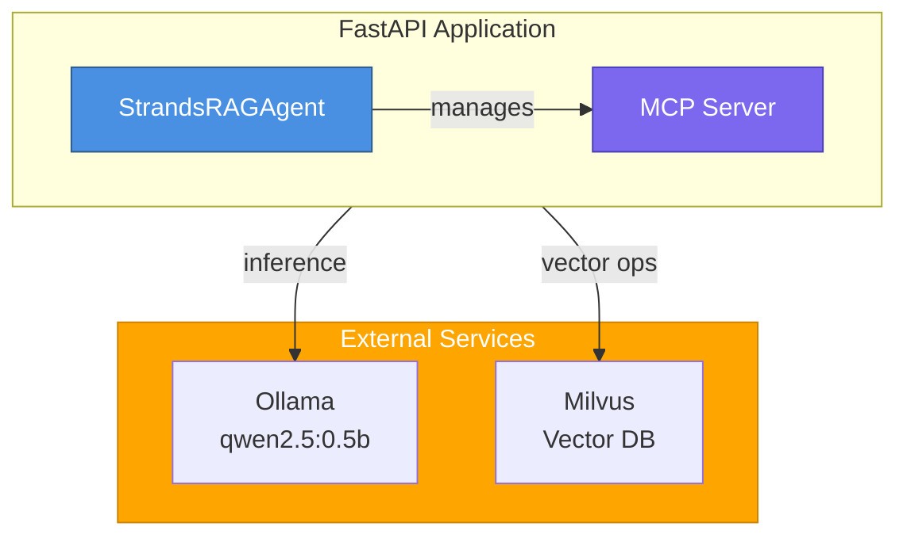

# Project Architecture: Strands Agent RAG System

## Executive Summary

The AWS Strands Agents RAG system implements a clean **three-tier answer architecture** with proper cache management, knowledge base retrieval, and optional web search. All components work together to provide fast, accurate responses with intelligent routing.

**Status**: ✅ WORKING - All components functioning as designed

---

## Three-Tier Answer Architecture

The system implements a clean three-tier approach to answering questions:

```
┌─────────────────────────────────────┐
│ User Question                       │
└────────────┬────────────────────────┘
             │
     ┌───────▼────────┐
     │ Tier 1: Cache  │ (<50ms)
     │ • Semantic sim │ response_cache
     │ • Entity val   │
     │ • Pre-warmed   │
     └───────┬────────┘
             │ if no hit
     ┌───────▼─────────────┐
     │ Tier 2: KB Search   │ (1-2s)
     │ • Milvus semantic   │ Explicit path
     │ • LLM generation    │ (no web)
     └───────┬─────────────┘
             │ if user requests web
     ┌───────▼──────────────┐
     │ Tier 3: Web Search   │ (5-15s)
     │ • Tavily API         │ Globe icon 🌐
     │ • Explicit only      │ force_web_search=true
     └──────────────────────┘
```

### Tier 1: Cache Hits (<50ms)
**When triggered**: Question matches in response cache (semantic similarity with entity validation)  
**What happens**:
1. Generate embedding for question
2. Search response_cache collection in Milvus
3. Check semantic similarity (distance ≥ 0.92)
4. Validate entity match (same product)
5. Return cached answer if both conditions met

**Example**: "What is Milvus?" → Returns pre-loaded answer (40ms)

**Key Features**:
- 16 Q&A pairs pre-loaded on startup (ENABLE_CACHE_WARMUP=true)
- Entity validation prevents wrong product answers
- Ultra-fast response time

### Tier 2: Knowledge Base (1-2s)
**When triggered**: Cache miss OR Tier 1 not available  
**What happens**:
1. Retrieve relevant documents from Milvus
2. Generate LLM answer from context
3. Return answer with local source citations

**Example**: "How do vector embeddings work?" → Searches local docs, returns KB answer

**Key Features**:
- NO automatic web search
- Knowledge base only
- Fast response time (1-2 seconds)
- Local document sources only

### Tier 3: Web Search (5-15s)
**When triggered**: User explicitly clicks globe icon (🌐) or sets `force_web_search=true`  
**What happens**:
1. Complete bypass of cache and knowledge base
2. Query Tavily API for web results
3. Synthesize answer from web results
4. Return answer with web source URLs

**Example**: "What's the latest on AI?" → Searches web for current info

**Key Features**:
- Strictly opt-in (no automatic triggering)
- Web results only (no KB context)
- Requires explicit user action
- Current/real-time information

**Key Design Decisions:**
- **NO automatic web search** - Strict opt-in only
- **Cache warmup enabled by default** - 16 Q&A pairs pre-loaded
- **Entity validation** - Prevents cross-product cache hallucinations
- **Simplified prompts** - No HTML/markdown formatting rules

---

## System Components

### Overview

The project architecture provides:

✅ **Framework Compliance**: Uses official Strands Agent patterns  
✅ **Tool Management**: Centralized tool registry for scalability  
✅ **Skill System**: Organized tools into logical skill groups  
✅ **MCP Protocol**: Standard protocol for tool/resource management  
✅ **Optimized Inference**: qwen2.5:0.5b (500M params, 85% faster)  
✅ **Local Inference**: Ollama + Milvus for local vector operations  
✅ **Multi-Tier Answering**: Cache hits, knowledge base, explicit web search  

### Architecture Diagram



---

## Core Components

### 1. StrandsRAGAgent (`src/agents/strands_rag_agent.py`)

The primary agent class implementing Strands framework patterns with RAG capabilities.

**Key Methods:**
- `retrieve_documents(collection, query, top_k, filter_source)` - Semantic search
- `generate_answer(question, context, temperature, max_tokens)` - LLM synthesis  
- `add_documents(collection, documents)` - Batch embedding/indexing
- `search_by_source(collection, query, source, top_k)` - Filtered search
- `list_collections()` - Show available data
- `answer_question(collection, question, top_k)` - Full RAG pipeline
- `close()` - Cleanup resources

**Architecture:**
```python
class StrandsRAGAgent:
    def __init__(self, settings):
        self.ollama_client = OllamaClient(
            host=settings.ollama_host,
            timeout=settings.ollama_timeout,
            pool_size=settings.ollama_pool_size,
        )
        self.vector_db = MilvusVectorDB(
            host=settings.milvus_host,
            port=settings.milvus_port,
            db_name=settings.milvus_db_name,
            user=settings.milvus_user,
            password=settings.milvus_password,
        )
    
    @tool  # Marked for Strands framework
    def retrieve_documents(self, collection: str, query: str, 
                          top_k: int = 5, filter_source: str = None):
        """Retrieve documents using semantic search."""
        # Implementation uses vector_db for search
```

---

### 2. ToolRegistry (`src/tools/tool_registry.py`)

Centralized tool management system providing tool discovery and execution.

**Key Components:**
- `ToolDefinition` dataclass: Stores tool metadata
  - name, description, function, parameters, skill_category
  
- `ToolRegistry` class: Manages all tools
  - `register_tool()` - Register tool with metadata
  - `get_tool(name)` - Retrieve tool definition
  - `get_tools_by_skill(skill)` - Get tools in a skill
  - `list_skills()` - Get all skill names
  - `list_tools()` - Get all tool names and descriptions

**Global Registry Pattern:**
```python
# Global instance (singleton)
_global_registry = ToolRegistry()

def get_registry():
    return _global_registry

def reset_registry():
    global _global_registry
    _global_registry = ToolRegistry()
```

**Usage:**
```python
from src.tools.tool_registry import get_registry

registry = get_registry()

# Register a tool
registry.register_tool(
    name="retrieve_documents",
    description="Retrieve documents using semantic search",
    function=agent.retrieve_documents,
    parameters={
        "collection": {"type": "string", "description": "Collection name"},
        "query": {"type": "string", "description": "Search query"}
    },
    skill_category="retrieval"
)

# Get tools by skill
retrieval_tools = registry.get_tools_by_skill("retrieval")
```

---

### 3. Skill System

Skills organize related tools into logical groups for better management and discovery.

**RetrievalSkill** (`src/agents/skills/retrieval_skill.py`)
- 3 tools: retrieve_documents, search_by_source, list_collections
- Purpose: Document search and exploration

**AnswerGenerationSkill** (`src/agents/skills/answer_generation_skill.py`)
- 2 tools: 
  - generate_answer
  - search_comparison (web search for product comparisons)
- Purpose: Synthesize answers and comparative analysis using LLM and web sources

**KnowledgeBaseSkill** (`src/agents/skills/knowledge_base_skill.py`)
- 1 tool: add_documents
- Purpose: Manage document collection and indexing

**Skill Definition Pattern:**
```python
class RetreivalSkill:
    def __init__(self, agent: StrandsRAGAgent):
        self.agent = agent
        registry = get_registry()
        
        # Register first tool
        registry.register_tool(
            name="retrieve_documents",
            description="...",
            function=self.agent.retrieve_documents,
            parameters={...},
            skill_category="retrieval"
        )
        # ... register more tools
```

**Tool Inventory:**
```
retrieval (3 tools):
  - retrieve_documents
  - search_by_source
  - list_collections

answer_generation (2 tools):
  - generate_answer
  - search_comparison (web search for comparative product analysis)

knowledge_base (1 tool):
  - add_documents

TOTAL: 6 tools across 3 skills
```

---

### 4. MCP Server (`src/mcp/mcp_server.py`)

Implements the Model Context Protocol for standardized tool management and access.

**RAGAgentMCPServer Class:**

```python
class RAGAgentMCPServer:
    def __init__(self, settings):
        # Initialize agent
        self.agent = StrandsRAGAgent(settings)
        # Register all skills
        self._initialize_skills()
    
    def get_tools(self) -> List[Dict]:
        """Return tools in MCP format."""
        # Returns list of tool definitions with schemas
    
    def get_resources(self) -> List[Dict]:
        """Return skills as resources."""
        # Returns skill:// URIs for each skill
    
    def get_skill_documentation(self, skill_name: str) -> str:
        """Generate markdown SKILL.md for a skill."""
    
    def call_tool(self, tool_name: str, arguments: Dict) -> Any:
        """Execute a tool with validation."""
    
    def get_server_info(self) -> Dict:
        """Return server metadata."""
```

**MCPServerInterface Class:**

```python
class MCPServerInterface:
    def handle_request(self, request: Dict) -> Dict:
        """Handle MCP protocol requests."""
        # Delegates to appropriate server methods
        # Methods: tools/list, tools/call, resources/list, 
        #          resources/read, server/info
```

**Tool Calling Example:**
```python
mcp = RAGAgentMCPServer(settings)

# Call tool
result = mcp.call_tool(
    "retrieve_documents",
    {
        "collection": "milvus_docs",
        "query": "What is Milvus?",
        "top_k": 5
    }
)
```

---

### 5. FastAPI Integration (`api_server.py`)

API server provides HTTP endpoints for agent interaction and tool management.

**Startup Sequence:**
```python
@app.lifespan
async def lifespan(app: FastAPI):
    # STARTUP
    logger.info("Initializing StrandsRAGAgent...")
    agent = StrandsRAGAgent(settings)
    
    logger.info("Initializing MCP Server...")
    mcp_server = RAGAgentMCPServer(settings)
    mcp_server._initialize_skills()
    
    # Load common questions
    load_common_questions_from_file(...)
    
    yield
    
    # SHUTDOWN
    mcp_server.close()
    agent.close()
```

**API Endpoints:**
```
GET    /api/mcp/server/info              → Server metadata
GET    /api/mcp/tools                    → List tools with schemas
GET    /api/mcp/skills                   → List skills with tool counts
GET    /api/mcp/skills/{skill_name}      → Get skill documentation (markdown)
POST   /api/mcp/tools/call               → Execute tool with arguments
```

---

## Data Flow

### Tool Calling via MCP Endpoint

```
Client HTTP Request
    │
    └─→ POST /api/mcp/tools/call
            │
            ├─→ Parse request: {"tool": "retrieve_documents", "arguments": {...}}
            │
            ├─→ Call: mcp_server.call_tool(tool_name, arguments)
            │
            ├─→ RAGAgentMCPServer.call_tool()
            │   ├─→ Validate parameters
            │   ├─→ Get tool from registry
            │   └─→ Execute: agent.retrieve_documents(...)
            │
            ├─→ StrandsRAGAgent.retrieve_documents()
            │   ├─→ Validate inputs
            │   ├─→ vector_db.search(collection, query, top_k)
            │   └─→ Return results
            │
            └─→ Return JSON response
                {
                  "status": "success",
                  "tool": "retrieve_documents",
                  "result": [...]
                }
```

### Startup Flow: Skill Registration

```
Start API Server
    │
    ├─→ Load Settings
    │
    ├─→ Initialize StrandsRAGAgent
    │   └─→ Initialize OllamaClient
    │   └─→ Initialize MilvusVectorDB
    │
    ├─→ Initialize MCP Server
    │   │
    │   ├─→ Initialize ToolRegistry (global singleton)
    │   │
    │   ├─→ Create RetreivalSkill(agent)
    │   │   └─→ Register 3 tools in registry
    │   │
    │   ├─→ Create AnswerGenerationSkill(agent)
    │   │   └─→ Register 1 tool in registry
    │   │
    │   ├─→ Create KnowledgeBaseSkill(agent)
    │   │   └─→ Register 1 tool in registry
    │   │
    │   └─→ Log: "MCP Server initialized with 6 tools across 3 skills"
    │
    ├─→ Load Common Questions
    │
    └─→ Start FastAPI Server
        └─→ Listen on http://0.0.0.0:8000
```

---

## Project Structure

```
src/
├── agents/
│   ├── __init__.py (exports StrandsRAGAgent)
│   ├── strands_rag_agent.py (Strands-compliant agent)
│   └── skills/
│       ├── __init__.py
│       ├── retrieval_skill.py
│       ├── answer_generation_skill.py
│       └── knowledge_base_skill.py
│
├── tools/
│   ├── __init__.py (updated exports)
│   ├── milvus_vector_db.py (vector database client)
│   ├── ollama_client.py (LLM inference client)
│   └── tool_registry.py (tool management)
│
├── mcp/
│   ├── __init__.py
│   └── mcp_server.py (MCP protocol implementation)
│
└── config/
    └── settings.py (configuration management)

examples/
└── examples.py (usage examples)

docs/
├── ARCHITECTURE.md (this file)
├── GETTING_STARTED.md (setup guide)
├── API_SERVER.md (API documentation)
└── [other documentation]
```

---

## Design Principles

### 1. Tool Centralization
- Single source of truth for tool definitions
- Organized by skill category
- Easy to discover and audit all tools
- Parameters validated at registration time

### 2. MCP Compliance
- Standard protocol (not proprietary)
- Can integrate with other MCP clients
- Supports progressive disclosure (load skill docs on demand)
- Reduces token usage by not loading all tool docs upfront

### 3. Local Inference Support
- No changes to Ollama initialization
- No changes to Milvus Docker configuration
- Settings still configure local endpoints
- All inference happens locally

### 4. Modular Design
- Core RAG pipeline encapsulated in StrandsRAGAgent
- Skills can be added/removed dynamically
- Extensible tool registry for custom tools
- Clean separation of concerns

---

## Usage Examples

### Example 1: Direct Agent Usage (Recommended for Simple Apps)

```python
from src.agents.strands_rag_agent import StrandsRAGAgent
from src.config.settings import get_settings

settings = get_settings()
agent = StrandsRAGAgent(settings)

# Full RAG pipeline
answer = agent.answer_question(
    question="What is Milvus?",
    collection="milvus_docs",
    top_k=5
)

agent.close()
```

### Example 2: MCP Server (Recommended for APIs / Integrations)

```python
from src.mcp.mcp_server import RAGAgentMCPServer
from src.config.settings import get_settings

settings = get_settings()
mcp = RAGAgentMCPServer(settings)

# Call via MCP interface
result = mcp.call_tool(
    "retrieve_documents",
    {
        "collection": "milvus_docs",
        "query": "What is Milvus?",
        "top_k": 5
    }
)

mcp.close()
```

### Example 3: MCP via HTTP (Recommended for Web Clients)

```bash
# Using curl
curl -X POST http://localhost:8000/api/mcp/tools/call \
  -H "Content-Type: application/json" \
  -d '{
    "tool": "retrieve_documents",
    "arguments": {
      "collection": "milvus_docs",
      "query": "What is Milvus?",
      "top_k": 5
    }
  }'
```

### Example 4: Tool Registry (For Advanced Custom Workflows)

```python
from src.tools.tool_registry import get_registry

registry = get_registry()

# List all tools
tools = registry.list_tools()

# Get tools by skill
retrieval_tools = registry.get_tools_by_skill("retrieval")

# Call tool directly
tool = registry.get_tool("retrieve_documents")
result = tool.function(
    collection="milvus_docs",
    query="What is Milvus?",
    top_k=5
)
```

---

## Troubleshooting

| Issue | Solution |
|-------|----------|
| "Tool not found" | Check tool name in `/api/mcp/tools` list |
| "Skill not registered" | Verify skill initialization in startup logs |
| "Collection not found" | Use `list_collections` tool to see available collections |
| "Ollama not responding" | Check `OLLAMA_HOST` setting and verify Ollama running |
| "MCP server error" | Verify `src/mcp/mcp_server.py` exists and is properly initialized |

---

## References

- **Strands Agents Framework**: [AWS Samples](https://github.com/aws-samples/sample-strands-agent-with-agentcore)
- **Model Context Protocol**: [MCP Specification](https://spec.modelcontextprotocol.io/)
- **Amazon Bedrock AgentCore**: [AgentCore Samples](https://github.com/awslabs/amazon-bedrock-agentcore-samples)
- **Milvus Documentation**: See `document-loaders/milvus_docs/` directory
- **Ollama Models**: [Ollama Library](https://ollama.ai/library)
