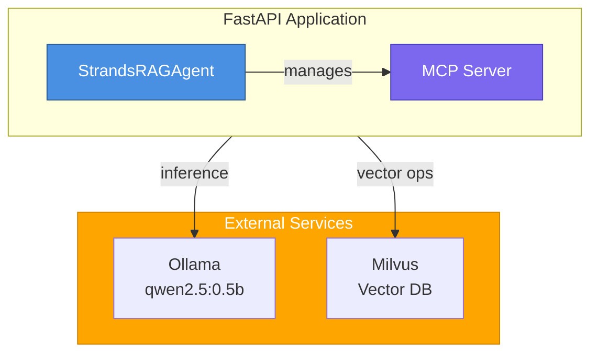

## Caching Implementation: Local (Strands) vs. Cloud (AgentCore)

### Local/Strands Mode

- **Short-Term Cache:**
    - In-memory Python dictionaries (process-local, not shared across restarts)
    - Used for fast response cache (recent answers, embeddings)
    - TTL (time-to-live) is typically minutes to hours, reset on process restart

- **Long-Term Cache:**
    - Optionally, Milvus collections can be used for persistent embedding storage
    - Pre-warmed Q&A pairs are loaded at startup for instant cache hits

- **Reasoning:**
    - Prioritizes speed and simplicity for local/dev use
    - No external dependencies or network latency
    - Cache is lost on restart, so not suitable for production persistence

### Cloud/AgentCore Mode

- **Short-Term Cache:**
    - Distributed cache using ElastiCache Redis (recommended) or DynamoDB
    - Shared across all Lambda invocations/containers
    - Used for embeddings, search results, and recent answers
    - TTL: 1 hour for embeddings, 24 hours for search results (configurable)

- **Long-Term Cache:**
    - Vector DB (Zilliz Cloud, Milvus on AWS, or OpenSearch) stores all document embeddings and indexed data
    - Persistent across deployments and restarts

- **Reasoning:**
    - Ensures cache is available to all stateless serverless functions
    - Redis provides low-latency, high-throughput for hot data
    - DynamoDB is a cost-effective alternative for lower traffic
    - Vector DB is the source of truth for all indexed knowledge

**Summary Table:**

| Mode         | Short-Term Cache         | Long-Term Cache         | Reasoning                                      |
|--------------|-------------------------|-------------------------|------------------------------------------------|
| Local        | In-memory dicts         | Milvus (optional)       | Fast dev, no persistence, simple                |
| Cloud        | Redis/DynamoDB          | Cloud Vector DB         | Shared, persistent, scalable, production-grade  |

#
# Dual-Mode Architecture: Strands (Local) and AgentCore (Cloud)

## Supported Deployment Modes

This system supports two primary deployment modes:

- **Strands (Local/Container):**
    - Default for local development and containerized deployments
    - Uses Ollama for LLM inference and Milvus for vector DB
    - Fast, cost-optimized, and easy to run locally or in Docker

- **AgentCore (Cloud/Serverless):**
    - For AWS Lambda/Bedrock serverless deployments
    - Distributed cache/session analytics (Redis/DynamoDB)
    - Integrates with Bedrock agents and AWS services

    **Cloud Vector Database Requirement:**
    - In AgentCore/cloud mode, all retrieval and indexing operations require a managed, cloud-accessible vector database instance.
    - Supported options:
        - **Zilliz Cloud** (managed Milvus)
        - **Milvus** deployed on AWS (ECS, EKS, or EC2 in VPC)
        - **Amazon OpenSearch** with vector search enabled (alternative to Milvus)
    - The Lambda/AgentCore handler must be configured with the vector DB endpoint, credentials, and network access (VPC/subnet/security group) to reach the cloud vector DB.
    - All document indexing and retrieval in serverless mode use this cloud vector DB (not a local instance).
    - **Configuration:**
        - Set the vector DB endpoint and credentials in your `.env` and `settings.py` (see `docs/GETTING_STARTED.md#configuration`)
        - Example:
            ```env
            VECTOR_DB_HOST=milvus-cloud-endpoint.zillizcloud.com
            VECTOR_DB_PORT=19530
            VECTOR_DB_USER=your_user
            VECTOR_DB_PASSWORD=your_password
            VECTOR_DB_USE_SSL=true
            ```
        - Ensure your Lambda function or container has network access to the vector DB (VPC/subnet/security group setup)
    - See [GETTING_STARTED.md](GETTING_STARTED.md#cloud-vector-db-setup) for full setup instructions.

## Switching Modes

Set the deployment mode in your `.env` file:

```env
# Local/Strands agent (default)
USE_AGENTCORE=false

# AgentCore (cloud/serverless)
USE_AGENTCORE=true
```

See `docs/GETTING_STARTED.md` for full configuration details.

## Entrypoints

- **Local/Strands:**
    - `python api_server.py` (FastAPI + Strands agent)
    - `python chatbots/interactive_chat.py` (interactive chat)

- **AgentCore (AWS Lambda):**
    - `src/agents/agentcore_handler.py` (Lambda handler)
    - See `docs/AGENTCORE_CACHING_STRATEGY.md` for serverless deployment

## Shared Logic

All core logic (retrieval, answer generation, cache, KB management) is modular and shared between both modes. See `src/tools/` and `src/agents/skills/` for details.

---
# Project Architecture: Strands Agent RAG System

## Executive Summary

The AWS Strands Agents RAG system implements a clean **three-tier answer architecture** with proper cache management, knowledge base retrieval, and optional web search. All components work together to provide fast, accurate responses with intelligent routing.

**Status**: ✅ WORKING - All components functioning as designed

---

## Three-Tier Answer Architecture

The system implements a clean three-tier approach to answering questions with intelligent routing:

```
┌──────────────────────────────────────┐
│ User Question                        │
└────────────┬─────────────────────────┘
             │
      ┌──────▼─────────────────────┐
      │ Detect Time-Sensitive?      │ Temporal keywords:
      │ (latest, trends, 2024...)   │ "latest", "2024", "current", etc.
      └──────┬────────┬─────────────┘
             │        │ YES → Skip cache
             │        └─────────────────────┐
             NO                             │
             │                              │
     ┌───────▼────────┐      ┌──────────────▼──────────┐
     │ Tier 1: Cache  │      │ Tier 2: Fresh KB Search │
     │ (<50ms)        │      │ (1-2s, no cache)        │
     │ • Semantic sim │      │ • Milvus retrieval      │
     │ • Entity val   │      │ • LLM generation        │
     │ • Pre-warmed   │      └────────┬─────────────────┘
     └───────┬────────┘               │
             │                        │
      ┌──────▼──────────┐    ┌────────▼──────────┐
      │ Cache Hit?      │    │ Answer Quality OK? │
      │ With Content    │    │ If empty/weak:     │
      └──┬──────────┬───┘    │ Trigger web search │
    YES  │ NO      │         └────────┬───────────┘
         │ or      │                  │
         │ EMPTY   │         ┌────────▼──────────┐
         │ ────────┼────────→│ Tier 3: Web Search│
     ┌───▼────┐    │         │ (5-15s, Tavily)   │
     │ Return │    │         │ • Query Tavily API│
     │ Cached │    │         │ • Synthesize web  │
     │ Answer │    │         │ • Cite sources    │
     └────────┘    │         └───────────────────┘
                   │
      ┌────────────▼──────────┐
      │ Tier 2: KB Search     │
      │ (1-2s, full query)    │
      │ • Milvus retrieval    │
      │ • LLM generation      │
      └───────────────────────┘
```

### Tier 1: Cache Hits (<50ms)
**When triggered**: Question matches in response cache (semantic similarity with entity validation) AND answer is not empty

**What happens**:
1. Check if query is time-sensitive (skip cache if true)
2. Generate embedding for question
3. Search response_cache collection in Milvus
4. Check semantic similarity (distance ≥ 0.92)
5. Validate entity match (same product)
6. **NEW**: Check if cached answer is empty
   - If empty: Trigger web search fallback (see Tier 3)
   - If content exists: Return cached answer

**Example**: "What is Milvus?" → Returns pre-loaded answer (40ms)

**Key Features**:
- 16 Q&A pairs pre-loaded on startup (ENABLE_CACHE_WARMUP=true)
- Entity validation prevents wrong product answers
- Ultra-fast response time
- **NEW**: Empty answer detection triggers automatic web search

### Tier 2: Knowledge Base (1-2s)
**When triggered**: Cache bypassed (time-sensitive query OR app startup) OR cache miss
**What happens**:
1. Retrieve relevant documents from Milvus
2. Generate LLM answer from context
3. **NEW**: Check KB result quality
   - If confidence is low: May trigger Tier 3 web search
   - If answer is empty: Trigger web search fallback
4. Return answer with local source citations

**Example**: "How do vector embeddings work?" → Searches local docs, returns KB answer

**Time-Sensitive Queries**:
- Keywords detected: "latest", "recent", "trending", "2024", "today", "breaking", "just released", etc.
- Behavior: Skip cache entirely, go directly to fresh KB search
- Benefit: Ensures up-to-date information for temporal queries

**Key Features**:
- Knowledge base as primary source
- Automatic cache bypass for temporal keywords
- Fast response time (1-2 seconds)
- Local document sources

### Tier 3: Web Search (3-15s) 
**When triggered**: 
- **Automatic Fallback**: Cache returns empty answer OR KB confidence is low
- **User-Explicit**: User clicks globe icon (🌐) or sets `force_web_search=true`

**What happens**:
1. Query Tavily API for web results
2. Generate answer from web context
3. Return answer with web source URLs and timestamps
4. Add web source badge to UI

**Example**: "What's the latest on AI?" → Automatically searches web OR user explicitly requests via 🌐 button

**Empty Cache Fallback Flow**:
```
Cache hit but answer is empty
    ↓
Set enable_web_search_fallback flag
    ↓
Continue to graph execution
    ↓
Web search triggered automatically
    ↓
Return web results with sources
```

**Key Features**:
- Automatic fallback when cache is empty or KB confidence is low
- Web results supplement KB knowledge
- User can force web-only via 🌐 button (`force_web_search=true`)
- Current/real-time information for time-sensitive queries

**Key Design Decisions:**
- **Automatic fallback enabled** - Web search triggered when cache empty or KB weak
- **Time-sensitive detection** - Temporal keywords bypass cache automatically
- **Cache warmup enabled by default** - 16 Q&A pairs pre-loaded
- **Entity validation** - Prevents cross-product cache hallucinations
- **Simplified prompts** - No HTML/markdown formatting rules

---

## System Components

### Overview

The project architecture provides:

✅ **Framework Compliance**: Uses official Strands Agent patterns
✅ **Tool Management**: Centralized tool registry for scalability
✅ **Skill System**: Organized tools into logical skill groups
✅ **MCP Protocol**: Standard protocol for tool/resource management
✅ **Optimized Inference**: qwen2.5:0.5b (500M params, 85% faster)
✅ **Local Inference**: Ollama + Milvus for local vector operations
✅ **Multi-Tier Answering**: Cache hits, KB search, automatic web fallback, explicit web search

### Architecture Diagram



---

## Strands Agent Framework Integration

The system uses **real Strands Agent instances** for the 3-node conditional routing graph:

### Three Specialized Strands Agents

**Node 1: TopicChecker Agent**
- **Model**: Fast model (llama3.2:1b or qwen2.5:0.5b)
- **Purpose**: Validates if query is about vector databases, RAG, embeddings, etc.
- **Latency**: ~100-150ms
- **Early Exit**: If validation fails → reject as "out-of-scope" (saves 1500+ms)
- **Framework**: `Strands Agent` with system_prompt, no tools

**Node 2: SecurityChecker Agent**
- **Model**: Fast model (llama3.2:1b or qwen2.5:0.5b)
- **Purpose**: Detects jailbreak attempts, prompt injection, malicious intent
- **Latency**: ~50-100ms
- **Early Exit**: If security risk detected → reject (saves 1500+ms)
- **Framework**: `Strands Agent` with system_prompt, no tools

**Node 3: RAGWorker Agent**
- **Model**: Powerful model (llama3.1:8b or larger)
- **Purpose**: Retrieves documents and generates comprehensive answers
- **Latency**: ~800-1500ms
- **Tools**:
  - `search_knowledge_base()` - Semantic search in Milvus
  - `generate_response()` - LLM-based answer synthesis
- **Framework**: `Strands Agent` with tools using `@tool` decorator

### Conditional Routing (Real Graph Execution)

```
Input Query
    ↓
┌─────────────────────────┐
│ TopicChecker Agent      │
│ (Fast model)            │
└────────┬────────────────┘
         ↓
    Is in-scope?
    ├─ NO  → REJECT (out-of-scope)
    └─ YES → Continue
         ↓
┌─────────────────────────┐
│ SecurityChecker Agent   │
│ (Fast model)            │
└────────┬────────────────┘
         ↓
    Is safe?
    ├─ NO  → REJECT (security risk)
    └─ YES → Continue
         ↓
┌─────────────────────────┐
│ RAGWorker Agent         │
│ (Powerful model + tools)│
└────────┬────────────────┘
         ↓
    Generate Answer + Sources
```

**Key Benefits**:
- ✅ **Actual conditional routing** - Only nodes in execution path run
- ✅ **Cost savings** - 60-70% reduction for invalid/malicious queries
- ✅ **Proper separation of concerns** - Each agent has single responsibility
- ✅ **Execution tracing** - See which path was taken
- ✅ **Model optimization** - Fast models for validation, powerful model for RAG

---

## System Components

### 1. StrandsGraphRAGAgent (`src/agents/strands_graph_agent.py`)

The primary agent class implementing **real Strands agent instances** with RAG capabilities.

**Structure:**
# Real Strands Agent instantiation
topic_agent = Agent(
    name="TopicChecker",
    system_prompt="Validate if query is about vector databases, embeddings, RAG...",
    model="llama3.2:1b",  # Fast model
    tools=[]
)

rag_agent = Agent(
    name="RAGWorker",
    system_prompt="Answer questions about Milvus using provided documents...",
    model="llama3.1:8b",  # Powerful model
    tools=[search_knowledge_base, generate_response]
)

# Real execution with routing
def answer_question(self, question: str):
    # Node 1: Topic validation
    topic_response = topic_agent.invoke(context={"user_query": question})
    if not topic_response.is_valid:
        return rejection_response("out_of_scope")

    # Node 2: Security validation
    security_response = security_agent.invoke(context={"user_query": question})
    if security_response.is_threat:
        return rejection_response("security_risk")

---

# AgentCore Serverless Implementation (Bedrock/Lambda)

This section summarizes how to deploy the Strands RAG agent using **AWS Bedrock AgentCore** on Lambda, with distributed caching and analytics for production-grade, cost-optimized serverless operation.

## Key Differences from Container-Based Deployment

- **Stateless execution**: No in-memory caches; all state must be externalized
- **Distributed cache**: Use ElastiCache Redis (recommended) or DynamoDB for embedding/search caches
- **Session analytics**: Use DynamoDB (AgentCore SessionManager) for question tracking and analytics
- **CloudWatch**: All metrics/logs routed to CloudWatch for observability

## Distributed Caching Patterns

- **ElastiCache Redis**:
    - Shared across all Lambda invocations
    - 1-3ms lookup, 1hr TTL for embeddings, 24hr TTL for search results
    - See [AGENTCORE_CACHING_STRATEGY.md](AGENTCORE_CACHING_STRATEGY.md#12-elasticache-redis-for-distributed-caching)
- **DynamoDB (alternative)**:
    - Lower cost, higher latency (5-15ms)
    - Use for dev/staging or low-traffic prod
    - See [AGENTCORE_CACHING_STRATEGY.md](AGENTCORE_CACHING_STRATEGY.md#14-dynamodb-alternative-to-elasticache-cost-optimization)

## Session Analytics with DynamoDB

- All user queries and agent responses are stored in the AgentCore session table
- Popular question analytics are computed via DynamoDB GSI queries
- See [AGENTCORE_CACHING_STRATEGY.md](AGENTCORE_CACHING_STRATEGY.md#13-dynamodb-analytics-for-question-tracking)

## Configuration & Environment Variables

Add the following to your `.env` for Lambda/AgentCore:

```bash
# Distributed Cache (choose one)
REDIS_CACHE_ENABLED=true
REDIS_HOST=rag-agent-cache.abc123.use1.cache.amazonaws.com
REDIS_PORT=6379
REDIS_DB=0
EMBEDDING_CACHE_TTL_HOURS=1
SEARCH_CACHE_TTL_HOURS=24
# OR
USE_DYNAMODB_CACHE=true
DYNAMODB_CACHE_TABLE=rag-agent-cache

# Session Analytics
AGENTCORE_SESSION_TABLE=agentcore-sessions
ENABLE_QUESTION_ANALYTICS=true
```

See [AGENTCORE_CACHING_STRATEGY.md](AGENTCORE_CACHING_STRATEGY.md#recommended-configuration-agentcore--lambda) for full details.

## Integration Points in the Codebase

- `src/tools/redis_cache.py` and `src/tools/dynamodb_cache.py`: Distributed cache clients
- `src/agents/strands_graph_agent.py`: Use `self.redis_cache` or `self.dynamodb_cache` for embedding/search caching
- `src/tools/dynamodb_analytics.py`: Popular question analytics
- `src/config/settings.py`: All cache/session config

## Implementation Roadmap & Best Practices

1. **Provision ElastiCache Redis or DynamoDB** (see [AGENTCORE_CACHING_STRATEGY.md](AGENTCORE_CACHING_STRATEGY.md#implementation-roadmap-agentcore-specific))
2. **Implement distributed cache classes** (`RedisDistributedCache`, `DynamoDBCache`)
3. **Integrate cache into agent** (replace in-memory caches)
4. **Enable session analytics** (DynamoDB GSI, API endpoint)
5. **Monitor with CloudWatch** (metrics, logs, cache hit rates)

**Best Practices:**
- Use Redis for high-traffic/low-latency, DynamoDB for cost-sensitive workloads
- Always externalize all state (no local file writes, no in-memory cache)
- Use TTLs to prevent stale cache entries
- Use CloudWatch for all metrics/logs
- See [AGENTCORE_CACHING_STRATEGY.md](AGENTCORE_CACHING_STRATEGY.md) for code samples and infrastructure YAML

---
**For detailed code, infrastructure, and analytics examples, see:**
- [AGENTCORE_CACHING_STRATEGY.md](AGENTCORE_CACHING_STRATEGY.md)
- [AWS_ARCHITECTURE.md](AWS_ARCHITECTURE.md)
- [DEVELOPMENT.md](DEVELOPMENT.md#agentcore-serverless-implementation)

    # Node 3: RAG (only reached if above passed)
    rag_response = rag_agent.invoke(
        context={"question": question, "search_results": [...]}
    )
    return rag_response
```

**Key Methods:**
- `answer_question(question, top_k)` - Orchestrates 3-node Strands workflow with conditional routing
- `retrieve_documents(query, top_k)` - @tool for semantic search in Milvus
- `generate_response(question, context)` - @tool for LLM-based answer synthesis
- `add_documents(collection, documents)` - Batch embedding and indexing
- `list_collections()` - Display available data collections
- `close()` - Cleanup resources

**Dependencies:**
- `strands-agents>=1.27.0` - Agent framework with @agent/@tool decorators
- `MilvusVectorDB` - Vector database client for semantic search
- `OllamaClient` - Local LLM inference with embedding support
```

---

### 2. ToolRegistry (`src/tools/tool_registry.py`)

Centralized tool management system providing tool discovery and execution.

**Key Components:**
- `ToolDefinition` dataclass: Stores tool metadata
  - name, description, function, parameters, skill_category

- `ToolRegistry` class: Manages all tools
  - `register_tool()` - Register tool with metadata
  - `get_tool(name)` - Retrieve tool definition
  - `get_tools_by_skill(skill)` - Get tools in a skill
  - `list_skills()` - Get all skill names
  - `list_tools()` - Get all tool names and descriptions

**Global Registry Pattern:**
```python
# Global instance (singleton)
_global_registry = ToolRegistry()

def get_registry():
    return _global_registry

def reset_registry():
    global _global_registry
    _global_registry = ToolRegistry()
```

**Usage:**
```python
from src.tools.tool_registry import get_registry

registry = get_registry()

# Register a tool
registry.register_tool(
    name="retrieve_documents",
    description="Retrieve documents using semantic search",
    function=agent.retrieve_documents,
    parameters={
        "collection": {"type": "string", "description": "Collection name"},
        "query": {"type": "string", "description": "Search query"}
    },
    skill_category="retrieval"
)

# Get tools by skill
retrieval_tools = registry.get_tools_by_skill("retrieval")
```

---

### 3. Skill System

Skills organize related tools into logical groups for better management and discovery.

**RetrievalSkill** (`src/agents/skills/retrieval_skill.py`)
- 3 tools: retrieve_documents, search_by_source, list_collections
- Purpose: Document search and exploration

**AnswerGenerationSkill** (`src/agents/skills/answer_generation_skill.py`)
- 2 tools:
  - generate_answer
  - search_comparison (web search for product comparisons)
- Purpose: Synthesize answers and comparative analysis using LLM and web sources

**KnowledgeBaseSkill** (`src/agents/skills/knowledge_base_skill.py`)
- 1 tool: add_documents
- Purpose: Manage document collection and indexing

**Skill Definition Pattern:**
```python
class RetreivalSkill:
    def __init__(self, agent: StrandsRAGAgent):
        self.agent = agent
        registry = get_registry()

        # Register first tool
        registry.register_tool(
            name="retrieve_documents",
            description="...",
            function=self.agent.retrieve_documents,
            parameters={...},
            skill_category="retrieval"
        )
        # ... register more tools
```

**Tool Inventory:**
```
retrieval (3 tools):
  - retrieve_documents
  - search_by_source
  - list_collections

answer_generation (2 tools):
  - generate_answer
  - search_comparison (web search for comparative product analysis)

knowledge_base (1 tool):
  - add_documents

TOTAL: 6 tools across 3 skills
```

---

### 4. MCP Server (`src/mcp/mcp_server.py`)

Implements the Model Context Protocol for standardized tool management and access.

**RAGAgentMCPServer Class:**

```python
class RAGAgentMCPServer:
    def __init__(self, settings):
        # Initialize agent
        self.agent = StrandsRAGAgent(settings)
        # Register all skills
        self._initialize_skills()

    def get_tools(self) -> List[Dict]:
        """Return tools in MCP format."""
        # Returns list of tool definitions with schemas

    def get_resources(self) -> List[Dict]:
        """Return skills as resources."""
        # Returns skill:// URIs for each skill

    def get_skill_documentation(self, skill_name: str) -> str:
        """Generate markdown SKILL.md for a skill."""

    def call_tool(self, tool_name: str, arguments: Dict) -> Any:
        """Execute a tool with validation."""

    def get_server_info(self) -> Dict:
        """Return server metadata."""
```

**MCPServerInterface Class:**

```python
class MCPServerInterface:
    def handle_request(self, request: Dict) -> Dict:
        """Handle MCP protocol requests."""
        # Delegates to appropriate server methods
        # Methods: tools/list, tools/call, resources/list,
        #          resources/read, server/info
```

**Tool Calling Example:**
```python
mcp = RAGAgentMCPServer(settings)

# Call tool
result = mcp.call_tool(
    "retrieve_documents",
    {
        "collection": "milvus_docs",
        "query": "What is Milvus?",
        "top_k": 5
    }
)
```

---

### 5. FastAPI Integration (`api_server.py`)

API server provides HTTP endpoints for agent interaction and tool management.

**Startup Sequence:**
```python
@app.lifespan
async def lifespan(app: FastAPI):
    # STARTUP
    logger.info("Initializing StrandsRAGAgent...")
    agent = StrandsRAGAgent(settings)

    logger.info("Initializing MCP Server...")
    mcp_server = RAGAgentMCPServer(settings)
    mcp_server._initialize_skills()

    # Load common questions
    load_common_questions_from_file(...)

    yield

    # SHUTDOWN
    if hasattr(mcp_server, 'close'):
        mcp_server.close()
    if hasattr(agent, 'close'):
        agent.close()
```

**API Endpoints:**
```
GET    /api/mcp/server/info              → Server metadata
GET    /api/mcp/tools                    → List tools with schemas
GET    /api/mcp/skills                   → List skills with tool counts
GET    /api/mcp/skills/{skill_name}      → Get skill documentation (markdown)
POST   /api/mcp/tools/call               → Execute tool with arguments
```

---

## Data Flow

### Tool Calling via MCP Endpoint

```
Client HTTP Request
    │
    └─→ POST /api/mcp/tools/call
            │
            ├─→ Parse request: {"tool": "retrieve_documents", "arguments": {...}}
            │
            ├─→ Call: mcp_server.call_tool(tool_name, arguments)
            │
            ├─→ RAGAgentMCPServer.call_tool()
            │   ├─→ Validate parameters
            │   ├─→ Get tool from registry
            │   └─→ Execute: agent.retrieve_documents(...)
            │
            ├─→ StrandsRAGAgent.retrieve_documents()
            │   ├─→ Validate inputs
            │   ├─→ vector_db.search(collection, query, top_k)
            │   └─→ Return results
            │
            └─→ Return JSON response
                {
                  "status": "success",
                  "tool": "retrieve_documents",
                  "result": [...]
                }
```

### Startup Flow: Skill Registration

```
Start API Server
    │
    ├─→ Load Settings
    │
    ├─→ Initialize StrandsRAGAgent
    │   └─→ Initialize OllamaClient
    │   └─→ Initialize MilvusVectorDB
    │
    ├─→ Initialize MCP Server
    │   │
    │   ├─→ Initialize ToolRegistry (global singleton)
    │   │
    │   ├─→ Create RetreivalSkill(agent)
    │   │   └─→ Register 3 tools in registry
    │   │
    │   ├─→ Create AnswerGenerationSkill(agent)
    │   │   └─→ Register 1 tool in registry
    │   │
    │   ├─→ Create KnowledgeBaseSkill(agent)
    │   │   └─→ Register 1 tool in registry
    │   │
    │   └─→ Log: "MCP Server initialized with 6 tools across 3 skills"
    │
    ├─→ Load Common Questions
    │
    └─→ Start FastAPI Server
        └─→ Listen on http://0.0.0.0:8000
```

---

## Project Structure

```
src/
├── agents/
│   ├── __init__.py (exports StrandsRAGAgent)
│   ├── strands_graph_agent.py (Graph-based 3-node agent)
│   └── skills/
│       ├── __init__.py
│       ├── retrieval_skill.py
│       ├── answer_generation_skill.py
│       └── knowledge_base_skill.py
│
├── tools/
│   ├── __init__.py (updated exports)
│   ├── milvus_vector_db.py (vector database client)
│   ├── ollama_client.py (LLM inference client)
│   └── tool_registry.py (tool management)
│
├── mcp/
│   ├── __init__.py
│   └── mcp_server.py (MCP protocol implementation)
│
├── config/
|    └── settings.py (configuration management)
docs/
├── ARCHITECTURE.md (this file)
├── GETTING_STARTED.md (setup guide)
├── API_SERVER.md (API documentation)
└── [other documentation]
```

---

## Design Principles

### 1. Tool Centralization
- Single source of truth for tool definitions
- Organized by skill category
- Easy to discover and audit all tools
- Parameters validated at registration time

### 2. MCP Compliance
- Standard protocol (not proprietary)
- Can integrate with other MCP clients
- Supports progressive disclosure (load skill docs on demand)
- Reduces token usage by not loading all tool docs upfront

### 3. Local Inference Support
- No changes to Ollama initialization
- No changes to Milvus Docker configuration
- Settings still configure local endpoints
- All inference happens locally

### 4. Modular Design
- Core RAG pipeline encapsulated in StrandsRAGAgent
- Skills can be added/removed dynamically
- Extensible tool registry for custom tools
- Clean separation of concerns

---

## Usage Examples

### Example 1: Direct Agent Usage (Recommended for Simple Apps)

```python
from src.agents.strands_graph_agent import StrandsGraphRAGAgent
from src.config.settings import get_settings

settings = get_settings()
agent = StrandsRAGAgent(settings)

# Full RAG pipeline
answer = agent.answer_question(
    question="What is Milvus?",
    collection="milvus_docs",
    top_k=5
)

# StrandsGraphRAGAgent doesn't require explicit close
if hasattr(agent, 'close'):
    agent.close()
```

### Example 2: MCP Server (Recommended for APIs / Integrations)

```python
from src.mcp.mcp_server import RAGAgentMCPServer
from src.config.settings import get_settings

settings = get_settings()
mcp = RAGAgentMCPServer(settings)

# Call via MCP interface
result = mcp.call_tool(
    "retrieve_documents",
    {
        "collection": "milvus_docs",
        "query": "What is Milvus?",
        "top_k": 5
    }
)

if hasattr(mcp, 'close'):
    mcp.close()
```

### Example 3: MCP via HTTP (Recommended for Web Clients)

```bash
# Using curl
curl -X POST http://localhost:8000/api/mcp/tools/call \
  -H "Content-Type: application/json" \
  -d '{
    "tool": "retrieve_documents",
    "arguments": {
      "collection": "milvus_docs",
      "query": "What is Milvus?",
      "top_k": 5
    }
  }'
```


---

## Production Architecture Checklist

For full production readiness, ensure the following architectural pieces are addressed (see referenced docs for details):

- **Authentication & Authorization**
    - Use API Gateway + Cognito (cloud/serverless) to secure endpoints and manage user sessions
    - See [AWS_ARCHITECTURE.md](AWS_ARCHITECTURE.md#authentication--authorization)

- **Observability**
    - Integrate CloudWatch for logs, metrics, and tracing (AgentCore mode)
    - Use local logging configuration for Strands mode
    - See [AWS_ARCHITECTURE.md](AWS_ARCHITECTURE.md#observability--monitoring)

- **Error Handling & Resilience**
    - Implement retry/backoff for vector DB and cache failures
    - Ensure graceful degradation if a dependency is unavailable
    - See [DEVELOPMENT.md](DEVELOPMENT.md#error-handling--resilience)

- **Infrastructure as Code (IaC)**
    - Use CloudFormation, CDK, or Terraform to provision all cloud resources (VPC, Lambda, Redis, Milvus, etc.)
    - See [AWS_ARCHITECTURE.md](AWS_ARCHITECTURE.md#infrastructure-as-code)

- **Data Privacy & Compliance**
    - Address data retention, encryption at rest/in transit, and compliance for user data and embeddings
    - See [AWS_ARCHITECTURE.md](AWS_ARCHITECTURE.md#data-privacy--compliance)

- **Scalability & Cost Controls**
    - Configure Lambda concurrency, cache sizing, and vector DB scaling
    - See [AWS_ARCHITECTURE.md](AWS_ARCHITECTURE.md#scalability--cost-controls)

- **CI/CD Pipeline**
    - Set up automated deployment/testing pipeline (GitHub Actions, CodePipeline, etc.)
    - See [DEVELOPMENT.md](DEVELOPMENT.md#cicd-pipeline)

---

### Example 4: Tool Registry (For Advanced Custom Workflows)

```python
from src.tools.tool_registry import get_registry

registry = get_registry()

# List all tools
tools = registry.list_tools()

# Get tools by skill
retrieval_tools = registry.get_tools_by_skill("retrieval")

# Call tool directly
tool = registry.get_tool("retrieve_documents")
result = tool.function(
    collection="milvus_docs",
    query="What is Milvus?",
    top_k=5
)
```

---

## Troubleshooting

| Issue | Solution |
|-------|----------|
| "Tool not found" | Check tool name in `/api/mcp/tools` list |
| "Skill not registered" | Verify skill initialization in startup logs |
| "Collection not found" | Use `list_collections` tool to see available collections |
| "Ollama not responding" | Check `OLLAMA_HOST` setting and verify Ollama running |
| "MCP server error" | Verify `src/mcp/mcp_server.py` exists and is properly initialized |

---

## References

- **Strands Agents Framework**: [AWS Samples](https://github.com/aws-samples/sample-strands-agent-with-agentcore)
- **Model Context Protocol**: [MCP Specification](https://spec.modelcontextprotocol.io/)
- **Amazon Bedrock AgentCore**: [AgentCore Samples](https://github.com/awslabs/amazon-bedrock-agentcore-samples)
- **Milvus Documentation**: See `document-loaders/milvus_docs/` directory
- **Ollama Models**: [Ollama Library](https://ollama.ai/library)
