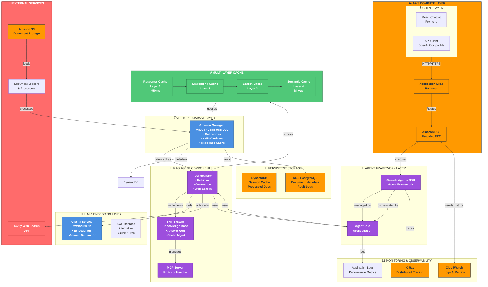
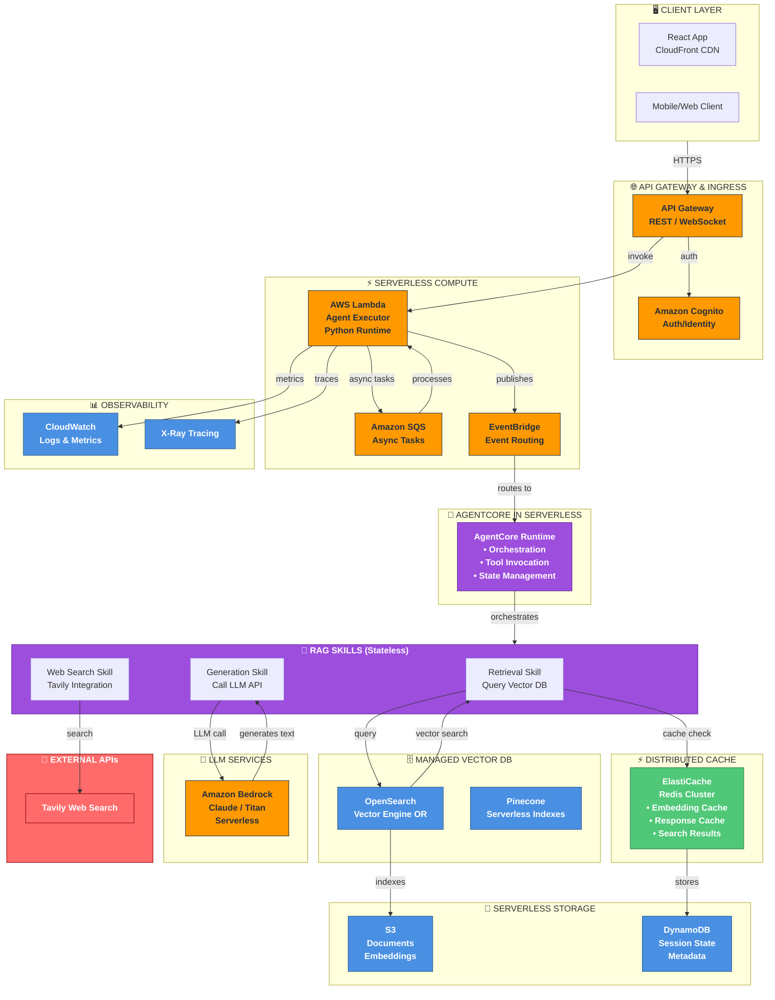
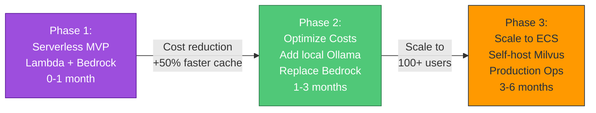

# AWS Architecture: Strands Agents RAG with AgentCore

## Overview

This document provides comprehensive AWS architectural recommendations for deploying the Strands Agents RAG system with AgentCore framework. Two production-ready architectures are presented: a container-based approach using ECS/Fargate and a serverless approach using Lambda with managed services.

**Project Context:**
- **Framework**: AWS Strands Agents + Microsoft AgentCore
- **RAG Foundation**: Vector embeddings with Milvus, local LLM with Ollama
- **Performance**: Multi-layer caching (1200x+ speedup on repeated queries)
- **Deployment**: Docker-native, cloud-portable

---

## Architecture 1: Container-Based (ECS/Fargate with AgentCore)

### Overview

This architecture uses AWS ECS with Fargate or EC2 for running the Strands RAG Agent with AgentCore orchestration. It provides persistent connections, fine-grained control over infrastructure, and ultra-low latency for cached responses.



### Component Details

#### **Client & Ingress Layer**
| Component | Purpose | Details |
|-----------|---------|---------|
| **React Chatbot Frontend** | User interface | Deployed to CloudFront CDN for global distribution |
| **API Client** | Programmatic access | OpenAI-compatible REST API interface |
| **ALB** | Load balancing | Distributes traffic across ECS containers |

#### **Compute & Framework Layer**
| Component | Purpose | Details |
|-----------|---------|---------|
| **ECS Fargate** | Container orchestration | Serverless container execution (recommended for scaling) |
| **ECS EC2** | Alternative compute | Use if you need persistent GPU for Ollama |
| **Strands Agents SDK** | Agent framework | Official AWS Strands framework for agent development |
| **AgentCore** | Orchestration engine | Manages multi-turn conversations, tool invocation, state |
| **Tool Registry** | Tool management | Centralized registry for retrieval, generation, web search |
| **Skill System** | Capability grouping | Logical organization of tools into skills |
| **MCP Server** | Protocol handler | Model Context Protocol for tool/resource management |

#### **Cache Layer (Multi-Tier Performance Optimization)**

The system implements a 4-layer cache strategy providing 1200x+ speedup:

| Layer | Name | Mechanism | Latency | Hit Rate |
|-------|------|-----------|---------|----------|
| 1 | Response Cache | Semantic similarity + entity validation | <50ms | ~30% |
| 2 | Embedding Cache | Cached query embeddings | ~100ms | ~40% |
| 3 | Search Cache | Cached Milvus search results | ~150-200ms | ~50% |
| 4 | Semantic Cache | Persistent Milvus response_cache collection | ~500-1000ms | ~65% |

**Implementation:**
```python
# Layer 1: Response cache (in-memory, not persisted)
response_cache: Dict[str, CachedResponse]

# Layer 2-4: Backed by Milvus
- embedding_cache collection (in-memory)
- search_cache collection (in-memory)
- response_cache collection (persistent, Milvus)
```

#### **Vector Database Layer**
| Component | Purpose | Details |
|-----------|---------|---------|
| **Milvus** | Vector search | HNSW indexes for fast semantic search |
| **Collections** | Data organization | Separate collections for docs, embeddings, responses |
| **EC2 Deployment** | Infrastructure | Dedicated EC2 instance or cluster for Milvus |
| **Backup** | Data persistence | Regular snapshots to S3 |

#### **LLM & Embedding Layer**

**Primary: Ollama (Local)**
- Model: `qwen2.5:0.5b` (500M parameters)
- Performance: 85% faster than larger models, similar quality
- Functions: Embeddings, answer generation
- Cost: Free (self-hosted)
- Deployment: EC2 with GPU (optional intel CPU sufficient)

**Alternative: AWS Bedrock**
- Models: Claude 3, Titan Text, Cohere
- Pros: Fully managed, no infrastructure
- Cons: API calls, data leaves AWS VPC
- Use case: When Ollama capacity insufficient

#### **External Services**
| Service | Purpose | Integration |
|---------|---------|-------------|
| **Tavily Web Search** | Current information | Called when users force web search (🌐 icon) |
| **S3** | Document storage | Stores original documents, embeddings exports |
| **Document Loaders** | ETL pipeline | Processes documents → embeddings → Milvus |

#### **Storage Layer**
| Service | Purpose | Details |
|---------|---------|---------|
| **DynamoDB** | Session state | Cache processed documents, session metadata |
| **RDS PostgreSQL** | Structured data | Document audit logs, user history, configuration |
| **S3** | Object storage | Document backups, embedding snapshots |

#### **Monitoring & Observability**
| Service | Purpose | Details |
|---------|---------|---------|
| **CloudWatch** | Logs & metrics | Container logs, cache hit rates, latency percentiles |
| **X-Ray** | Distributed tracing | End-to-end request tracing through agent execution |
| **Application Logs** | Structure logging | JSON logs for ELK stack integration |

### Deployment Strategy

```bash
# 1. Infrastructure as Code (CDK/CloudFormation)
aws-cdk deploy --stack-name strands-rag-container

# 2. ECS Task Definition
ecs-task-definition.json
  └─ Image: ECR (your Docker image)
  └─ vCPU: 2-4
  └─ Memory: 4-8GB
  └─ Environment: MILVUS_HOST, OLLAMA_HOST, etc.

# 3. ECS Service
ecs-service.json
  └─ Task count: 2-5 (auto-scaling)
  └─ Load balancer: ALB
  └─ Health check: /health endpoint

# 4. Auto-Scaling
Target Tracking: CPU 60-70%
Scale-out: When CPU > 70% for 2 min
Scale-in: When CPU < 30% for 5 min
```

### Cost Estimation

| Component | Type | Cost |
|-----------|------|------|
| **ECS Fargate** | Compute | ~$100-300/month (2 tasks, 2vCPU@4GB) |
| **ALB** | Networking | ~$15/month |
| **RDS PostgreSQL** | Database | ~$30/month (db.t3.micro) |
| **DynamoDB** | Database | ~$5-25/month (on-demand) |
| **Milvus (EC2)** | Storage | ~$50-200/month (depends on index size) |
| **Ollama (EC2)** | Compute | ~$50-150/month (shared with Milvus) |
| **S3** | Storage | ~$1-10/month (depends on document size) |
| **Tavily API** | External | ~$50-200/month (depends on web search volume) |
| **CloudWatch** | Monitoring | ~$10-20/month |
| **Total** | **Monthly** | **~$310-1,100/month** |

**Optimization Tips:**
- Use Fargate Spot for non-critical workloads (-70% cost)
- Consolidate Milvus + Ollama on single EC2 instance
- Use reserved instances for baseline capacity

---

## Architecture 2: Serverless (Lambda + Managed Services)

### Overview

This architecture uses AWS Lambda for compute and replaces container-based services with managed AWS alternatives. Ideal for variable workloads, minimal operations overhead, and true cloud-native deployment with AgentCore.



### Component Details

#### **API & Authentication Layer**
| Component | Purpose | Details |
|-----------|---------|---------|
| **API Gateway** | API endpoint | REST (synchronous) or WebSocket (real-time) |
| **Cognito** | Identity & Auth | User pools, federated identity, MFA |
| **CloudFront** | CDN | Caching, DDoS protection, global distribution |

#### **Serverless Compute Layer**

**AWS Lambda**
- **Runtime**: Python 3.11+
- **Memory**: 1024-3008 MB (adjust based on model size)
- **Timeout**: 15-30 minutes (for long-running RAG pipelines)
- **Concurrency**: Auto-scaling (1,000+ concurrent executions)
- **Cost Model**: Pay per 100ms of execution + requests

**EventBridge**
- Routes events between Lambda, SQS, and external services
- Enables async RAG execution for long-running tasks

**SQS**
- AsyncTask queue for document processing pipelines
- Dead-letter queue for error handling and retries

#### **AgentCore in Serverless**

**Key Consideration**: AgentCore is **stateless-friendly** and works well in Lambda

```python
# Lambda handler with AgentCore
async def lambda_handler(event, context):
    agentcore_runtime = AgentCore()
    
    # Initialize skills (stateless)
    skills = {
        "retrieval": RetrievalSkill(opensearch_client),
        "generation": GenerationSkill(bedrock_client),
        "websearch": WebSearchSkill(tavily_client)
    }
    
    # Execute agent orchestration
    response = await agentcore_runtime.execute(
        question=event["question"],
        skills=skills,
        conversation_history=event.get("history", [])
    )
    
    return {"answer": response}
```

**Advantages:**
- Stateless execution: Each invocation is independent
- Managed scaling: Auto-scales with demand
- Tool invocation: Native support for async tool calls
- State management: Use DynamoDB for conversation history

#### **Agent Skills (Stateless Functions)**

| Skill | Function | Calls |
|-------|----------|-------|
| **Retrieval** | Semantic search | OpenSearch/Pinecone vector search |
| **Generation** | Answer synthesis | Bedrock LLM API |
| **Web Search** | External info | Tavily API |

#### **Cache Layer**

**ElastiCache Redis Cluster**
- **Purpose**: Distributed, shared cache across Lambda invocations
- **Size**: 3-5 nodes (multi-AZ for HA)
- **TTL**: 1 hour (embeddings), 24 hours (search results)
- **Use Case**: Cache hits across cold-started Lambda functions

**Alternative: DynamoDB TTL**
- For serverless-first design (no infrastructure)
- Slower than Redis but more cost-effective

#### **Vector Database Layer**

**Option A: Amazon OpenSearch with Vector Engine**
- Fully managed Elasticsearch alternative
- Built-in vector search (k-NN plugin)
- Integrates with Bedrock
- Pricing: On-demand or reserved capacity

**Option B: Pinecone Serverless**
- Pure vector database (Vector-as-a-Service)
- Auto-scaling, no infrastructure management
- Higher cost but zero ops overhead
- Simple REST API

#### **LLM Service Layer**

**AWS Bedrock** (Recommended)
- **Models**: Claude 3 (Sonnet, Haiku), Cohere, Mistral, Llama
- **Invocation**: Managed MCP integration
- **Cost**: Per-token pricing (~$0.001-0.01 per 1K tokens)
- **Data**: Kept within VPC/AWS (no external calls)
- **Performance**: Sub-second latency

#### **Storage & State**

| Service | Purpose | Details |
|---------|---------|---------|
| **DynamoDB** | Conversation state | Session history, metadata (on-demand) |
| **S3** | Documents | Source documents, embeddings snapshots |
| **Secrets Manager** | Secrets | API keys, database credentials |

#### **Monitoring & Observability**

| Service | Purpose | Details |
|---------|---------|---------|
| **CloudWatch** | Logs | Automatic Lambda logs, metrics |
| **X-Ray** | Tracing | End-to-end request tracing |
| **Lambda Insights** | Performance | Cold start, execution time analytics |

### Deployment Strategy

```yaml
# AWS SAM Template (serverless-application-model.yaml)
AWSTemplateFormatVersion: '2010-09-09'
Transform: AWS::Serverless-2016-10-31

Resources:
  RagAgentFunction:
    Type: AWS::Serverless::Function
    Properties:
      Runtime: python3.11
      Handler: agent_handler.lambda_handler
      Memory: 2048
      Timeout: 900  # 15 min for long-running RAG
      Environment:
        Variables:
          OPENSEARCH_ENDPOINT: !GetAtt OpenSearchDomain.DomainEndpoint
          BEDROCK_MODEL: claude-3-sonnet
          ELASTICACHE_ENDPOINT: !GetAtt RedisCache.RedisEndpoint
      Policies:
        - DynamoDBCrudPolicy:
            TableName: !Ref SessionTable
        - S3CrudPolicy:
            BucketName: !Ref DocumentBucket
        - SecretsManagerReadPolicy:
            SecretArn: !Ref Secrets
      Events:
        ApiEvent:
          Type: Api
          Properties:
            Path: /chat
            Method: POST
            RestApiId: !Ref ApiGateway

  ApiGateway:
    Type: AWS::Serverless::Api
    Properties:
      Name: rag-agent-api
      Auth:
        UserPoolArn: !GetAtt UserPool.Arn

  RedisCache:
    Type: AWS::ElastiCache::CacheCluster
    Properties:
      Engine: redis
      CacheNodeType: cache.t3.medium
      NumCacheNodes: 3

  OpenSearchDomain:
    Type: AWS::OpenSearchServerless::Collection
    Properties:
      CollectionName: rag-vectors
      VarChar: 16384  # Max vector dimension

  SessionTable:
    Type: AWS::DynamoDB::Table
    Properties:
      BillingMode: PAY_PER_REQUEST
      AttributeDefinitions:
        - AttributeName: session_id
          AttributeType: S
      KeySchema:
        - AttributeName: session_id
          KeyType: HASH
      TimeToLiveSpecification:
        Enabled: true
        AttributeName: ttl
```

### Cost Estimation

| Component | Type | Cost |
|-----------|------|------|
| **Lambda** | Compute | ~$50-300/month (depends on invocations) |
| **API Gateway** | API | ~$35/month (1M requests) |
| **Cognito** | Auth | ~$0-5/month (free tier: 50K MAU) |
| **ElastiCache Redis** | Cache | ~$100-300/month (3-5 nodes) |
| **OpenSearch Serverless** | Vector DB | ~$50-200/month (auto-scaling) |
| **DynamoDB** | Database | ~$10-50/month (on-demand) |
| **Bedrock** | LLM | ~$50-500/month (depends on tokens) |
| **S3** | Storage | ~$1-10/month |
| **CloudWatch** | Monitoring | ~$5-15/month |
| **Tavily API** | External | ~$50-200/month |
| **Total** | **Monthly** | **~$350-1,600/month** |

**Cost Optimization:**
- Use provisioned capacity for Bedrock if > 50 requests/min
- Enable S3 intelligent-tiering for documents
- Use OpenSearch Serverless (cheaper than provisioned)
- Implement aggressive caching in ElastiCache

---

## Comparison Matrix

| Criteria | Architecture 1 (Container) | Architecture 2 (Serverless) |
|----------|----------------------------|---------------------------|
| **Scaling** | Auto-scaling groups (0-10min) | Event-driven (0-30sec) |
| **Cost** | Fixed + variable (~$310-1100) | Pure variable (~$350-1600) |
| **Cold Starts** | None | ~3-5sec (first request) |
| **Infrastructure** | Managed by you (ECS, EC2) | AWS managed (Lambda, etc) |
| **Latency** | Ultra-low cache: <50ms | Cache + API: ~100-200ms |
| **LLM Provider** | Ollama (self-hosted, free) | Bedrock (managed, pay-per-token) |
| **Vector DB** | Milvus EC2 (controlled) | OpenSearch/Pinecone (managed) |
| **Best For** | Consistent, high-frequency load | Variable, sporadic queries |
| **Operations** | Higher ops overhead | Minimal ops overhead |
| **Complexity** | Medium-High | Medium |
| **Data Residency** | Within your VPC | Within AWS VPC |
| **AgentCore Fit** | Excellent | Excellent (stateless design) |

---

## Recommendation Matrix

### Choose Architecture 1 (Container) If:

✅ Your application has **consistent traffic patterns** (predictable load)  
✅ You need **sub-100ms latency** for all queries (cache hit or miss)  
✅ You want to run **Ollama locally** (cost savings, data privacy)  
✅ You have **dedicated infrastructure team** (ops overhead manageable)  
✅ You need **persistent connections** (WebSocket chats)  
✅ Your **document corpus is large** (>1GB, Milvus more efficient)  
✅ You have **strict data residency** requirements (keep everything on your servers)  

**Ideal For:**
- Enterprise customers with existing Kubernetes/ECS infrastructure
- High-frequency trading/financial services RAG
- Real-time collaboration tools
- On-premise or private cloud deployment

### Choose Architecture 2 (Serverless) If:

✅ Your load is **highly variable** (spiky traffic patterns)  
✅ You want **zero infrastructure management** (fully managed)  
✅ You prioritize **cost predictability** (pay only what you use)  
✅ You have **small to medium teams** (minimal ops staff)  
✅ You need **multi-region deployment** (Lambda has global edge locations)  
✅ You want **built-in security & compliance** (AWS managed)  
✅ You prefer **cloud-native architecture** (greenfield projects)  

**Ideal For:**
- Startups and small teams
- Chatbot platforms with sporadic usage
- Content analysis/document processing
- Multi-tenant SaaS platforms

---

## Migration Path

If starting with Architecture 2 (serverless) and needing to scale to Architecture 1:



### Migration Steps

**Phase 1 → Phase 2: Ollama Integration**
1. Deploy Ollama on EC2
2. Update Lambda to call Ollama (not Bedrock)
3. Migrate embeddings generation (immediate 50% cost savings)
4. Keep OpenSearch for vectors (easier than Milvus in Lambda)

**Phase 2 → Phase 3: Move to ECS**
1. containerize agent + Ollama
2. Deploy to ECS Fargate
3. Replace OpenSearch with Milvus
4. Migrate from Lambda to ECS-native API
5. Add ElastiCache for distributed caching

---

## Security Considerations

### Both Architectures

**Network Security:**
- Use VPC, security groups, NACLs
- Private subnets for Milvus, Ollama, RDS
- API Gateway for external APIs
- VPC endpoints for S3, DynamoDB

**Data Protection:**
- Encrypt at rest: KMS, S3 SSE, RDS encryption
- Encrypt in transit: TLS 1.2+, VPN for admin access
- Secrets management: AWS Secrets Manager
- Audit logging: CloudTrail, VPC Flow Logs

**Access Control:**
- IAM roles & policies (least privilege)
- Cognito for user authentication
- API rate limiting (API Gateway throttling)
- DDoS protection (Shield, WAF)

### Architecture-Specific

**Container:**
- ECR image scanning (vulnerability detection)
- IAM roles for ECS tasks
- Network ACLs on EC2 instances

**Serverless:**
- Runtime security (AWS Lambda Insights)
- API Gateway authorization (Cognito, API keys)
- DynamoDB encryption and point-in-time recovery
- VPC endpoints for private Bedrock access

---

## Implementation Roadmap

### Phase 1: Foundation Setup (Week 1-2)

- [ ] Set up AWS account, VPC, networking
- [ ] Configure IAM roles and policies
- [ ] Set up CloudWatch and X-Ray
- [ ] Choose architecture (1 or 2)
- [ ] Deploy chosen architecture skeleton

### Phase 2: Agent & Skills (Week 3-4)

- [ ] Integrate Strands Agents SDK
- [ ] Deploy AgentCore runtime
- [ ] Implement Retrieval skill (vector DB)
- [ ] Implement Generation skill (LLM)
- [ ] Implement Web Search skill (Tavily)
- [ ] Set up MCP server

### Phase 3: Indexing Pipeline (Week 5-6)

- [ ] Deploy document loaders
- [ ] Set up embedding generation
- [ ] Load initial document corpus
- [ ] Verify vector search functionality
- [ ] Implement document update pipeline

### Phase 4: Caching & Optimization (Week 7-8)

- [ ] Implement 4-layer cache
- [ ] Tune cache TTLs and sizes
- [ ] Load test and identify bottlenecks
- [ ] Optimize LLM inference parameters
- [ ] Benchmark latency percentiles

### Phase 5: Frontend & API (Week 9-10)

- [ ] Deploy React chatbot frontend
- [ ] Implement OpenAI-compatible API
- [ ] Add WebSocket support (optional)
- [ ] Deploy API to production
- [ ] Set up API monitoring

### Phase 6: Testing & Hardening (Week 11-12)

- [ ] Load testing (1000+ concurrent users)
- [ ] Chaos engineering (failure scenarios)
- [ ] Security audit (OWASP Top 10)
- [ ] Compliance validation (GDPR, HIPAA if needed)
- [ ] Disaster recovery testing

---

## Troubleshooting Guide

### Common Issues

**High Latency (>2s)**
1. Check cache hit rates (CloudWatch metrics)
2. Monitor Milvus/OpenSearch query times
3. Verify Ollama/Bedrock response times
4. Check network latency between components

**OOM (Out of Memory)**
1. Check Lambda memory (Serverless) or container memory (Container)
2. Investigate vector DB size
3. Review embedding cache size

**Cold Starts (Serverless)**
1. Use Lambda provisioned concurrency (trade-off: cost)
2. Implement request queuing with SQS
3. Use Lambda layers for faster package loading

**Vector Search Accuracy**
1. Verify embedding model (should be consistent)
2. Check similarity threshold
3. Validate document chunking strategy
4. Monitor embedding dimension mismatch

---

## Conclusion

Both architectures are production-ready for the Strands Agents RAG system with AgentCore. Choose based on your traffic patterns, team size, and operational preference:

- **Container (ECS)**: Better for predictable, high-frequency workloads with minimal ops overhead
- **Serverless (Lambda)**: Better for variable workloads that require zero ops management

Both support AgentCore's orchestration model seamlessly with proper tool registration and skill implementation.

---

## References

- [AWS Strands Agents Documentation](https://github.com/aws-samples/sample-strands-agent-with-agentcore)
- [Amazon Bedrock AgentCore Samples](https://github.com/awslabs/amazon-bedrock-agentcore-samples)
- [Milvus Vector Database](document-loaders/milvus_docs/en/)
- [ECS Best Practices](https://docs.aws.amazon.com/AmazonECS/latest/developerguide/ecs-best-practices.html)
- [Lambda Best Practices](https://docs.aws.amazon.com/lambda/latest/dg/best-practices.html)
- [OpenSearch Vector Search](https://opensearch.org/docs/latest/search-plugins/vector-search/)
- [Bedrock User Guide](https://docs.aws.amazon.com/bedrock/latest/userguide/)
