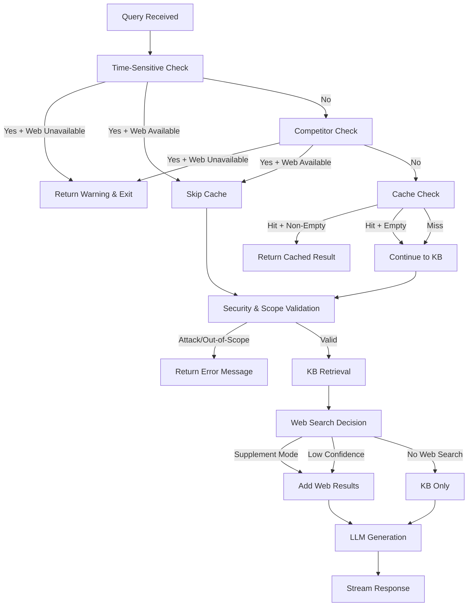

# Query Routing and Search Paths

This document provides a comprehensive analysis of the different query routing paths, validation layers, and decision logic in the AWS Strands RAG system.

## Overview

The system implements a sophisticated routing architecture that determines how queries are processed based on their characteristics, API parameters, and resource availability. The routing logic ensures optimal performance, proper caching behavior, and consistent error handling across all paths.

## Route Decision Matrix

| **API Parameter** | **Streaming Method** | **Non-Streaming Method** | **Purpose** |
|------------------|---------------------|---------------------------|-------------|
| **Normal** (default) | `stream_answer()` | `answer_question()` | Full pipeline: Cache → KB → Web (supplement) |
| **bypass_cache=true** | `stream_answer_no_cache()` | `answer_question_no_cache()` | Skip cache, fresh KB retrieval |
| **force_web_search=true** | `stream_answer_web_search_only()` | `answer_question_web_search_only()` | Web search only, no KB |

## Query Classification System

### Time-Sensitive Queries
**Detection Keywords**: `"recent"`, `"latest"`, `"current"`, `"new"`, `"updated"`, `"today"`
```python
def _is_time_sensitive_query(self, question: str) -> bool:
    temporal_keywords = ["recent", "latest", "current", "new", "updated", "today", ...]
    return any(keyword in question.lower() for keyword in temporal_keywords)
```

**Behavior**:
- Skip response cache (temporal data shouldn't be cached)
- Require web search for current information
- Early exit with warning if web search unavailable

### Competitor Database Queries  
**Detection**: Mentions of non-Milvus vector databases with typo tolerance and enhanced technical term matching
```python
competitor_patterns = {
    "pinecone": ["pinecone", "pinecode", "pine cone", "pincone"],
    "weaviate": ["weaviate", "weviate", "weaveate"],
    "qdrant": ["qdrant", "quadrant", "q-drant"],
    # ... + more variations
}

# Enhanced detection (Apr 12, 2026 fix):
# 1. Info-requesting patterns: "what is", "tell me about", "features", "capabilities"
# 2. Tech-specific patterns: competitor + "database", "vector", "search", "index", etc.
```

**Behavior**:
- Skip response cache (external service info shouldn't be cached as Milvus content)
- Require web search for accurate external information  
- Early exit with warning if web search unavailable
- Prevent hallucination from Milvus KB about competitor products
- **Enhanced Coverage**: Now detects technical queries like "pinecone vector search" or "weaviate database features"

### Security & Scope Validation
**Security Attack Detection**: Jailbreak attempts, prompt injection, malicious queries
**Scope Validation**: Ensures queries are related to databases, vector search, RAG, embeddings

## Detailed Routing Flows

### 1. Normal Path (Default)
**Entry Point**: `stream_answer()` / `answer_question()`
**Triggers**: Default behavior when no special parameters are set



**Cache Behavior**: 
- Checks response cache for similar questions
- Skips cache for time-sensitive/competitor queries
- Returns cached results for exact/similar matches

**Web Search Integration**: 
- Supplement mode: Adds web results to KB context
- Fallback mode: Web search when KB confidence is low
- Optional based on `ENABLE_WEB_SEARCH_SUPPLEMENT` setting

### 2. No-Cache Path
**Entry Point**: `stream_answer_no_cache()` / `answer_question_no_cache()`
**Triggers**: `bypass_cache=true` parameter

**Flow**: Identical to normal path but skips all cache operations
- Always performs fresh KB retrieval
- Still applies time-sensitive/competitor early exit logic
- Used for debugging or when fresh results are explicitly needed

### 3. Web Search Only Path
**Entry Point**: `stream_answer_web_search_only()` / `answer_question_web_search_only()`
**Triggers**: `force_web_search=true` parameter

**Flow**: 
- Bypasses all KB operations
- Performs only web search
- No validation layers (security, scope, competitor detection)
- Limited support (non-streaming version returns error message)

## Validation Layer Architecture

### Layer 1: Query Classification
```python
# Applied to Normal and No-Cache paths
is_time_sensitive = self._is_time_sensitive_query(question)
is_competitor_query = _is_competitor_database_query(question)
```

### Layer 2: Early Exit Logic
```python
# For time-sensitive and competitor queries
if (is_time_sensitive or is_competitor_query) and not web_search_available:
    return _create_web_search_unavailable_message('standard')  # DRY principle
```

### Layer 3: Topic & Security Validation (Strands Agents)
```python
# TopicChecker Agent - Fixed Apr 12, 2026
topic_response = await topic_agent.invoke_async(context={"user_query": question})
is_valid = "yes" in topic_response.content.lower()  # Fixed: was "true"

# SecurityChecker Agent  
security_response = await security_agent.invoke_async(context={"user_query": question})
is_safe = ("safe" in response_text.lower() or "yes" in response_text.lower())
```

**Topic Validation Fix**: The system now correctly parses "YES/NO" responses from the TopicChecker agent instead of looking for "true/false", ensuring proper scope validation.

## Error Messaging System (DRY Implementation)

All error messages are centralized in utility functions to ensure consistency:

### Web Search Unavailable Messages
```python
def _create_web_search_unavailable_message(message_type: str) -> Dict[str, str]:
    standard_message = "Web search features are currently unavailable due to API quota or authentication issues. Please try again later."
    
    messages = {
        'standard': standard_message,    # Time-sensitive & competitor queries
        'competitor': standard_message,  # Same message for consistency (DRY)
        'kb_fallback': "...The following response is based only on our knowledge base.",
        'stream_note': "**Note:** ...This response is based only on the knowledge base."
    }
```

### No Web Results Messages
```python
def _create_no_web_results_message(message_type: str) -> Dict[str, str]:
    messages = {
        'standard': 'No current information found. Web search returned no results...',
        'competitor': 'No current information about this external service could be found...'
    }
```

## Caching Strategy

| **Query Type** | **Validation Order** | **Early Exit Logic** | **Cache Behavior** |
|-------------- |---------------------|---------------------|-----------------|
| **Competitor** | Competitor Check → Web Required (Early Exit) | Before topic validation | Skip cache |
| **Time-Sensitive** | Time-Sensitive Check → Web Required (Early Exit) | Before topic validation | Skip cache |
| **Out-of-Scope** | Topic Check (Node 1) → REJECT | After competitor/time-sensitive | Cache rejection |
| **Regular KB** | Topic Check → Security Check → RAG Worker | Full 3-node pipeline | Use cache |

**Current Implementation (Apr 12, 2026)**: Competitor and time-sensitive query detection occurs BEFORE topic validation for performance optimization. This prioritizes early exit for queries requiring web search, reducing processing overhead for external information requests that would be expensive to validate through the full graph pipeline.

### Cache Hit Handling
```python
if cached:
    answer = cached.get("response", "")
    if answer.strip():  # Non-empty cached answer
        return stream_cached_result(answer)
    else:  # Empty cache hit - treat as cache miss
        logger.info("Cache hit but answer is empty - triggering web search fallback")
        continue_to_processing()
```

## Performance Characteristics

| **Path** | **Typical Latency** | **Resource Cost** | **Accuracy** | **Primary Use Case** |
|----------|-------------------|------------------|--------------|---------------------|
| **Cached Hit** | ~50ms | Very Low | High | Repeated questions |
| **Normal KB** | ~500ms | Low | High | Milvus documentation |
| **KB + Web Supplement** | ~1500ms | Medium | Highest | Enhanced accuracy |
| **Web Search Only** | ~800ms | Medium | Variable | External queries |
| **Early Exit Warning** | ~10ms | Very Low | N/A | Invalid/unavailable |

## API Usage Examples

### Normal Query (Default)
```bash
curl -X POST "http://localhost:8000/v1/chat/completions" \
  -H "Content-Type: application/json" \
  -d '{
    "messages": [{"role": "user", "content": "What is Milvus indexing?"}],
    "stream": true
  }'
```
**Route**: `stream_answer()` → Cache check → KB retrieval → Response

### Fresh Query (Bypass Cache)
```bash
curl -X POST "http://localhost:8000/v1/chat/completions?bypass_cache=true" \
  -H "Content-Type: application/json" \
  -d '{
    "messages": [{"role": "user", "content": "What is Milvus indexing?"}],
    "stream": true
  }'
```
**Route**: `stream_answer_no_cache()` → Skip cache → Fresh KB retrieval → Response

### Web Search Query
```bash
curl -X POST "http://localhost:8000/v1/chat/completions" \
  -H "Content-Type: application/json" \
  -d '{
    "messages": [{"role": "user", "content": "Compare vector databases"}],
    "stream": true,
    "force_web_search": true
  }'
```
**Route**: `stream_answer_web_search_only()` → Web search → Response

### Time-Sensitive Query (Automatic Routing)
```bash
curl -X POST "http://localhost:8000/v1/chat/completions" \
  -H "Content-Type: application/json" \
  -d '{
    "messages": [{"role": "user", "content": "What are recent updates in vector databases?"}],
    "stream": true
  }'
```
**Route**: `stream_answer()` → Time-sensitive detection → Web search required → Warning if unavailable

### Competitor Query (Automatic Routing)
```bash
curl -X POST "http://localhost:8000/v1/chat/completions" \
  -H "Content-Type: application/json" \
  -d '{
    "messages": [{"role": "user", "content": "Tell me about Pinecone features"}],
    "stream": true
  }'
```
**Route**: `stream_answer()` → Competitor detection → Web search required → Warning if unavailable

## Troubleshooting Guide

### Common Issues

**Issue**: Competitor queries returning Milvus information
**Cause**: Web search unavailable, falling back to KB
**Solution**: Check Tavily API keys and quota limits

**Issue**: Time-sensitive queries returning stale information  
**Cause**: Web search supplement disabled or unavailable
**Solution**: Enable `ENABLE_WEB_SEARCH_SUPPLEMENT=true` and verify web search availability

**Issue**: Inconsistent error messages
**Cause**: Multiple hardcoded error messages (legacy)
**Solution**: ✅ Fixed - All messages now use centralized utility functions

**Issue**: Cache hits for competitor queries
**Cause**: Competitor detection not applied before cache check
**Solution**: ✅ Fixed - Early detection prevents cache lookup

### Debug Commands

**Test Competitor Detection**:
```python
python -c "
from src.agents.strands_graph_agent import _is_competitor_database_query
print(_is_competitor_database_query('Tell me about Pinecone?'))  # Should be True
print(_is_competitor_database_query('Tell me about Milvus?'))    # Should be False
"
```

**Test Time-Sensitive Detection**:
```python  
python -c "
from src.agents.strands_graph_agent import StrandsGraphRAGAgent
agent = StrandsGraphRAGAgent()
print(agent._is_time_sensitive_query('What are recent updates?'))  # Should be True
print(agent._is_time_sensitive_query('What is indexing?'))         # Should be False
"
```

**Validate Web Search Integration**:
```bash
# Check if web search is configured
grep -r "TAVILY" .env
# Expected: TAVILY_API_KEY=your_key_here
```

## Configuration Settings

### Environment Variables
```bash
# Web Search Configuration
TAVILY_API_KEY=your_tavily_api_key                    # Required for web search
ENABLE_WEB_SEARCH_SUPPLEMENT=true                     # Enable web search supplements

# Cache Configuration  
ENABLE_RESPONSE_CACHE=true                             # Enable response caching
MILVUS_COLLECTION_NAME=milvus_docs                     # Default KB collection

# Model Configuration
OLLAMA_MODEL=llama3.1:8b                              # Primary LLM model
OLLAMA_EMBED_MODEL=nomic-embed-text                    # Embedding model
```

### Runtime Settings
```python
# In src/config/settings.py
class Settings:
    enable_web_search_supplement: bool = True          # Web search supplements
    default_top_k: int = 5                             # KB retrieval count
    max_tokens: int = 2000                             # Response length limit
    ollama_model: str = "llama3.1:8b"                  # LLM model
```

## Future Enhancements

### Planned Improvements
1. **Dynamic Route Selection**: ML-based routing decisions
2. **Response Quality Scoring**: Automatic fallback triggers
3. **Multi-Modal Queries**: Support for image/document queries  
4. **Streaming Improvements**: Better error handling in streaming responses
5. **Cache Optimization**: Semantic similarity-based cache matching

### Architecture Considerations
1. **Load Balancing**: Distribute queries across multiple agent instances
2. **Rate Limiting**: Per-user query limits and quotas
3. **Monitoring**: Comprehensive metrics and alerting
4. **A/B Testing**: Route comparison and performance analysis

## Related Documentation
- [API Server Documentation](API_SERVER.md) - REST endpoint specifications
- [Architecture Overview](ARCHITECTURE.md) - System design and components  
- [Web Search Integration](WEB_SEARCH_INTEGRATION.md) - Tavily integration details
- [Caching Strategy](CACHING_STRATEGY.md) - Cache implementation details
- [Development Guide](DEVELOPMENT.md) - Code examples and patterns